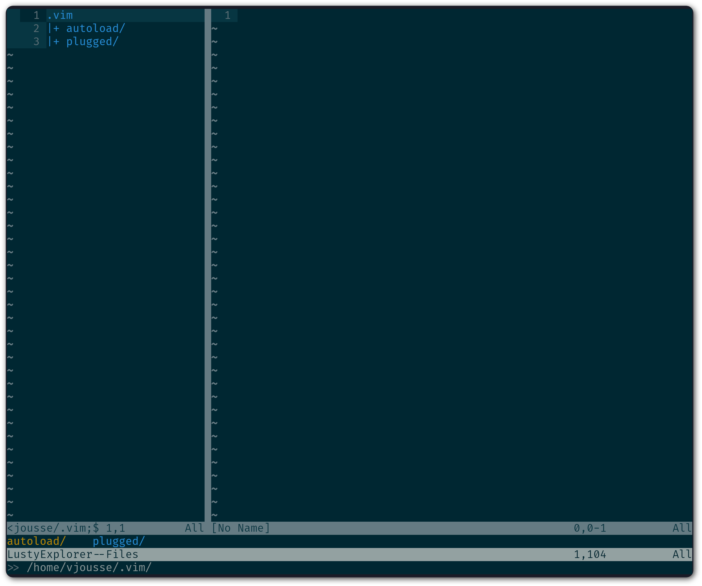
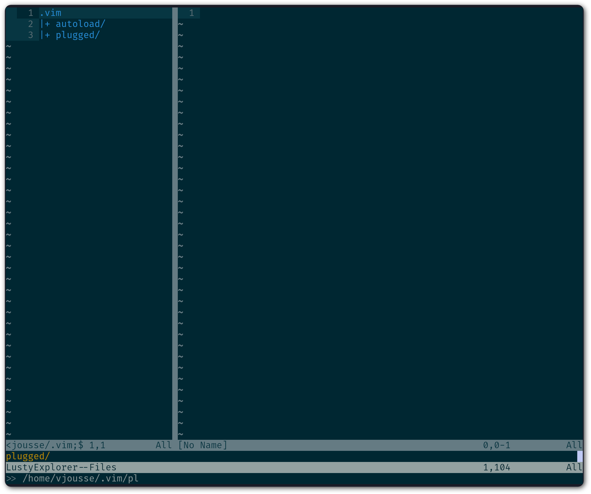
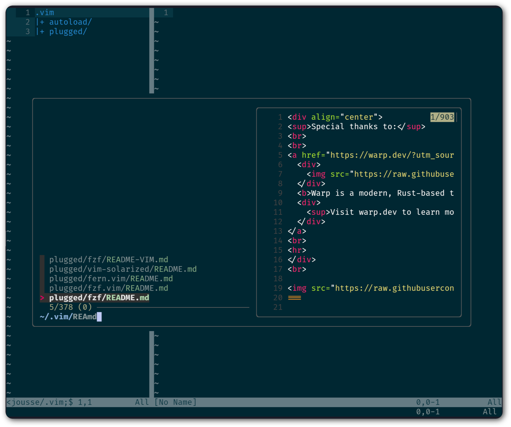
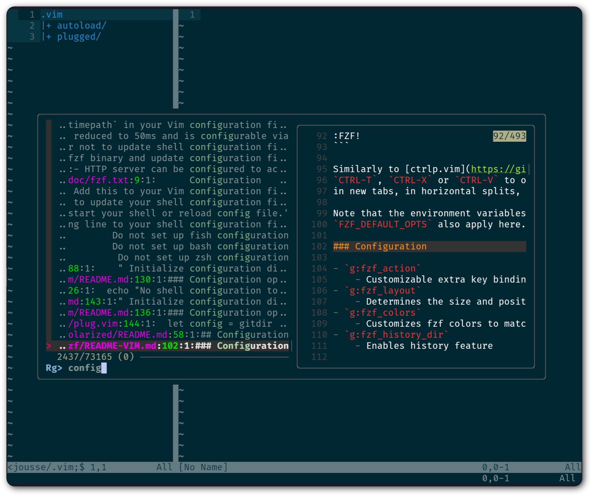
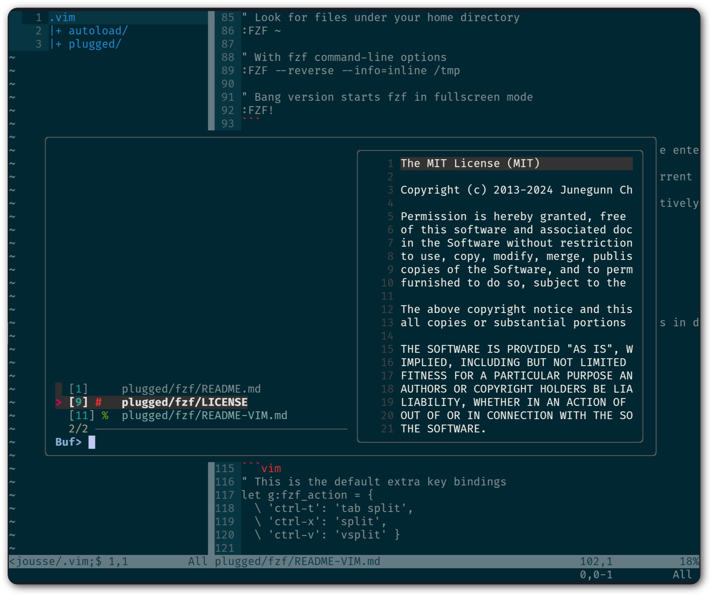

.. _plugins:

*****************
Essential plugins
*****************

Let's be clear, using |vim| without plugins is almost useless. It's the usage of plugins that will allow you to boost your productivity. You don't need a lot of them, but you do need the good ones.

Of course, |vim| can be used without any plugins and it can be useful to know how to use it without needing to install anything. Indeed, on most servers, you will have zero plugins installed. That's why knowing how to open and save a file and knowing how to switch between files just by using default commands is very useful. However, for your writing or coding needs, plugins are mandatory.

.. _seclusty:

Managing and switching between files : *Lusty Explorer*
=======================================================

We've already talked about *vim-fern* in :ref:`secvimfern` and we have seen that thanks to it, we can have a project explorer in a sidebar. One of the problems of this plugin is that it was not designed to be used with the keyboard. You can still use the keyboard, but it will not be as efficient as a plugin developed with keyboard usage in mind.

The first plugin that I install when I have to use |vim| is *Lusty Explorer* (https://www.vim.org/scripts/script.php?script_id=1890). This plugin will allow you to navigate between the files on you hard drive in order to open files without using the mouse. Moreover, it will allow you to easily switch between you opened files, called buffers in |vim| terms. Let's start by installing it via *vim-plug*. As usual, add the line below to the plugins already listed in your |vimrc|:

.. code-block:: vim

    " Install Lusty Explorer
    Plug 'sjbach/lusty'

Let's see how to use it. If we take a look at the documentation, here is what we find:

.. code-block:: html

    <Leader>lf  - Opens filesystem explorer.
    <Leader>lr  - Opens filesystem explorer at the directory of the current file.
    <Leader>lb  - Opens buffer explorer.
    <Leader>lg  - Opens buffer grep. 

We can see that the documentation is referring to a key named |tleader| that you need to combine with keys like *lf*, *lr*, *lb* et *lg*. The |tleader| key is a special key that we need to define in our |vimrc|. Almost each plugin will need this special key to be defined, so we will use it a lot. This is a good way to avoid collisions with the default shortcuts of |vim|.

So, we need to choose a key to be our |tleader| key. By default, |vim| uses ``\`` as a |tleader| key. I don't know about you, but for me this is not handy at all. I don't love to use my little finger too much. So I always replace the default |tleader| key with the |tcomma| key. You can of course choose another key, but lot of people are using |tcomma|: it's up to you. To tell it to |vim|, you will need to add a line in your |vimrc| as follows:

.. code-block:: vim
    
    " Use , as the mapleader key
    let mapleader = ","

Ensure that the modification has been made and taken into account by |vim|. This can be done by restarting |vim|, or by typing ``:so ~/.vimrc`` or ``:so $MYVIMRC`` in normal mode. Once this is done, you should be able to do ``,lr`` (if you choose ``,`` as your |tleader| key) and you should see something like the picture below in your |vim| (note the display of the contents of your current folder at bottom left).

.. _la capture d'écran de lusty: lusty_

.. _lusty:

You can see on the `lusty`_ screenshot that *Lusty Explorer* is made of two parts. The bottom part is about the current directory you're exploring and the top part is the content of this directory. The current item is highligthed. For example, on the `lusty`_ screenshot above, the current item is the ``.autoload/`` directory, highligthed in yellow (the color could be different, it depends on your theme).

*Lusty Explorer* uses something called *Fuzzy matching* that will allow you to type only a small part of the file or directory you want to select. This part can be everything: the begining of the filename, the middle, the end or just letters composing the file to select. In the example above, if I enter ``pl`` in the *Lusty* window, ``plugged/`` will be selected without needing to specify the full name. Then I just need to press |ttenter| to open the corresponding file in |vim|. You can see this particular example in the screenshot below.

.. _fuzzy:

Here are some handy handy shortcuts of *Lusty Explorer*:

* |tctrl| + |tn| select the next file/directory
* |tctrl| + |tp| select the previous file/directory
* |tctrl| + |tw| go the the parent directory
* |tctrl| + |te| create a new empty file (unsaved) with the current name entered in *Lusty Explorer*. If you want to save the file, you just have to use ``:w``.

So *Lusty Explorer* can be used for two things: navigate your filesystem with ``,lr`` and ``,lf``, and switch between your opened files (buffers) with ``,lb``. Personally, I don't use the ``,lg`` keys a lot to search in the buffers, but it's up to you.

In order to get familiar with *Lusty Explorer* you should try to open multiple files with ``,lr`` or ``,lf``. Then, try to switch between the opened files with the help of ``,lb``. This is the combination I'm using the most on a day to day basis.

This plugin is totally mandatory and adds a lot of value to |vim| as it allows you to avoid using the mouse to open files. Be sure to take the time to learn how to use it, it's a great time investment.

Search for files, strings and more: *fzf*
=========================================

In the IT world, there's a very effective way of finding things whose names we know “just about”. It's called **Fuzzy Matching** (see https://en.wikipedia.org/wiki/Approximate_string_matching). This technique enables us to find files for which we know part of the name, or part of the parent directory and part of the name, for example. It will also enable us to do the same for file contents: no need to be very precise (uppercase, lowercase, accents, etc.), **Fuzzy Matching** will return whatever is closest to the term we're looking for.

`fzf <https://github.com/junegunn/fzf>`_ is the reference in the field: it allows you to do **Fuzzy Matching** just about anywhere, and especially with vim (good timing, eh 🤓)!

Installing *fzf*
---------------------

Add these two lines to your plugins in your |vimrc| to install *fzf* and the corresponding |vim| plugin :::

    " Install fzf
    Plug 'junegunn/fzf', { 'do': { -> fzf#install() } }
    Plug 'junegunn/fzf.vim'

Then add these mappings further down in your file (anywhere after the ``call plug#end()``):

.. code-block:: vim

    ""-- FZF mappings
    " We search the files in the current directory
    nmap <silent> <Leader>ff :Files<CR>
    " Search in open buffers
    nmap <silent> <Leader>fb :Buffers<CR>
    " We search the contents of files
    nmap <silent> <Leader>fr :Rg<CR>

As usual, to take these changes into account, type ``:so ~/.vimrc`` or ``:so $MYVIMRC`` in normal mode, then ``:PlugInstall`` to install the two plugins.

Search files by name
--------------------

Type ``,ff`` in normal mode (or ``:Files``) and you should see a window similar to the following screenshot: fzf-files_

.. _fzf-files:

Depending on where you opened your |vim|, the results will of course be different. I opened it in the ``.vim`` directory. You may notice that I just typed `REAmd` and it automatically found all files named `README.md`. It even highlighted the filenames to make the match, in our case the `REA` at the beginning of the filename and then the `md` in the file extension.

You can navigate the search results with the default |vim| shortcuts, namely ``Ctrl-k`` to move the selection one line above and ``Ctrl-j`` to move the selection one line below. Then simply press |ttenter| to open the selected file. Note the file preview to the right of the opened window. You can navigate through this preview using ``Shift-up`` and ``Shift-down`` (yes, there's no |vim| shortcut for this function!).

Searching for strings in files
------------------------------

To search files, we're going to use a tool called `rg` (for `ripgrep`). Make sure you have it installed - instructions are available on rg's `github <https://github.com/BurntSushi/ripgrep#installation>`_. If you're not familiar with `ripgrep`, it's high time you replaced your traditional `grep` with `rg`: it's much more powerful and much better overall.

Once `rg` is installed, type ``,fr`` in normal mode (or ``:Rg``) and you should see a window similar to :ref:`the following screenshot<fzf-rg>` open :

.. _fzf-rg:

In my example, *fzf* found the text *config* within the file ``README-VIM.md`` under the heading ``### Configuration``.

Search in buffer names
----------------------

Type ``,fb`` in normal mode (or ``:Buffers``) and you should see a window similar to :ref:`the following screenshot<fzf-buffers>` open :

.. _fzf-buffers:

You'll note that I had 3 files (buffers) open, and you'll have noticed that this feature is similar to the one already present in `LustyExplorer`. The choice is yours!

A full version of the configuration file is available online at https://vimebook.com/link/v2/en/full.

Advanced plugins
================

Writing an entire book about the |vim| plugin is definitely something doable, but I have to admit that I don't have enough courage. So, I will stop here with the plugins thing. However, below is a list of some plugins that may interest you. This list comes from a poll I did on Twitter asking my followers what were the most useful |vim| plugins to them. Here it is:

* **coc.vim**. This is a plugin that will turn your |vim| into a complete IDE à la VSCode: auto-completion of functions, classes, “go to definition”, etc. Although the trend is towards simpler plug-ins that integrate with `LSPs (Language Server Protocol) directly <https://github.com/prabirshrestha/vim-lsp>`_, *coc.vim* has the advantage of being complete, tested and based on VSCode-like configurations. It also has the disadvantage of using javascript. The Github repo: https://github.com/neoclide/coc.nvim.
* **surround**. With this plugin, you can manage (change, add, delete) everything that "surrounds": parenthesis, brackets, quotes, etc. For example, you will be able to change "Hello world!" with 'Hello world!' or <q>Hello world!</q> with a simple key combination. The Github repo: https://github.com/tpope/vim-surround
* **fugitive**. If you work with source code, you have to use a version control system. If it's not the case, you can go flog yourself. Otherwise, if you're using Git, fugitive was made for you. It allows you to manage your git command directly inside |vim|. The Github repo can be found here:  https://github.com/tpope/vim-fugitive
* **ALE**. ALE checks the syntax of your source code for you. Like VSCode, for example, it will display your syntax errors directly in |vim|. Can save you a lot of time if you often edit code. If you want to use it with *coc.vim*, make sure you set ``"diagnostic.displayByAle": true`` in your ``:CocConfig`` as mentioned in the `ALE Github <https://github.com/dense-analysis/ale?tab=readme-ov-file#cocnvim>`_ repository. The Github repo is here: https://github.com/dense-analysis/ale
