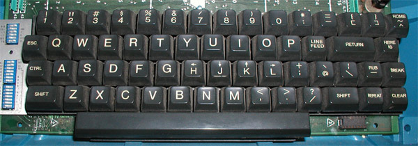

****************************************
The text editor you've always dreamed of
****************************************

I confess, I have some weird dreams. But hey, maybe my dreams are not as weird as they seem: dreaming of a tool that can improve all the professional areas of my life as a programmer, writer, teacher, and more doesn't seem that weird after all.

The success of |vim| is due to its ability to **ease the text manipulations**. Certainly, it will provide you with functionalities dedicated to specific tasks (often via plugins) as syntax highlighting, spell checking, and so on, but in the end, it's always writing/fixing/handling/moving text that takes most of your time.

This is where the difference lies between |vim| and IDEs like VSCode/Eclipse/Netbeans/PhpStorm and others. Such an IDE will put the focus on the particularities of your programming language while providing basic text manipulation functionalities. |vim| takes the opposite approach: you will by default be **very effective** at manipulating/writing text, no matter what kind of text. But then, when you feel the need, you will be able to enrich |vim| with plugins specific to your needs and programming languages.

This chapter will cover how to use |vim| the right way (you will begin to forget your mouse) and the logic behind all these obscure commands. By the end of this chapter, you should be able to **completely avoid using your mouse** to edit/handle text. In any case, you should force yourself not to use the mouse when learning |vim|. It's not that hard to only use the keyboard, and it will make a huge diffrence in your day to day life.

.. _moving:

Learning how to move: the copy/paste use case
=============================================

We have already seen in the ":ref:`insertmode`" section how to switch between the insert mode (to write text) and the normal mode (for the moment, you don't need to totally understand the purpose of this mode). When you press |tti| your cursor will switch to the insert mode (when you are already in the normal mode) and when you press |ttesc| it will switch back to the normal mode. Well, that's cool. So now, what else?

Preamble
--------

Now is the time to learn our first text manipulation: the famous copy/paste. I can already hear some of you saying that it is useless: you already know how to do that. You switch to the insert mode, you use your mouse (or you move using the directional keys while holding |ttshift|) to select some text. Then you go to the ``edit`` menu of your terminal and you select ``copy``. Then, ``edit`` menu and ``paste``. That works, so why not do that?

If you have understood the ":ref:`modes`" section about the ideal position of your hands on the keyboard, you should know that you did things you are not supposed to do:

- You used your mouse
- You moved your right hand a lot from its rest position, to press the directional keys that are far away from your fingers

Of course, it doesn't really matter, but it's totally ineffective (using your mouse or moving your right hand toward the directional keys is very slow) and harmful for your hands. This is your last chance: if you are not ready to force yourself to not do it, **Vim is not for you**. |vim| does a perfect job at keeping your hands on the keyboard and at keeping you away from your mouse. If you don't do it, you will not be using |vim| to its fullest. And, one day or another, **you will quit for another editor** that was made to be used with a mouse. So, should we continue?

Forget the mouse
----------------

If you are reading thoses lines it means that you have answered "yes" to the question above, so let's go! Our first step will be to get rid of the mouse. Then we will do the same with directional keys, but first things first.

To copy/paste using |vim|, you will have to switch to the "normal" mode (the default one when you open |vim|). To know what the current mode is, just have a look at the bottom left of your |vim|. You can see |vim| in "insert" mode in `the figure below`.

.. _the figure below: `mode insert`_

.. _mode insert:

When there is nothing displayed at the bottom left, it's because you are currently in "normal" mode. In order to quit a mode to return to the normal one, you just have to press |ttesc|. You may already have noticed that pressing |ttesc| is a pain for your fingers. Don't worry, this is just temporary. I will explain why in the ":ref:`secesc`" section.

Let's say that you are currently in the "normal" mode and that you already have some text in you |vim| (inserted by yourself by switching to insert mode with |tti| then back to normal mode with |ttesc|). For example, it could be this beautiful quote from Mark Twain: "They did not know it was impossible, so they did it.". Your |vim| should like the one in the figure below. Notice that there is nothing displayed at the bottom left, it means we are in *normaal* mode.

.. _twain:

The most intuitive way (but not the most efficient, we will see why a little bit later) to copy/paste the "impossible" word is to move the cursor at the first letter of the word using the directional keys, to press |ttv| (to switch to the "visual" mode), to move to the last letter of the word (you should have the word "impossible" highlighted) and then to press |tty| (|tty| stands for *yank*). You've just copied your first word using |vim|. Hooray!

Then, move to the end of the sentence using the arrow keys (in *normal* mode) and press |ttp| (|ttp| standing for *paste*). The word should now be pasted at the end, and you should have something like the figure below.

.. _vim-paste:

We can see that |vim| uses the mode switching trick (including the "normal" mode for moving) in order to not have to use the mouse.
When you will be used to switch quickly from one mode to another (and in order to do so, going without |ttesc| will be mandatory), using the mouse will appear like a pure waste of time. But obviously, you will first need to train yourself.

.. _forgetting-the-directional-keys:

Forgetting the directional keys
===============================

Here we are. Even if forgetting the mouse is a first good step, the real goal when using |vim| is to forget the directional keys too. You will be faster and better when using |vim| on the sole condition that you don't use the directional keys anymore. It will indeed force you to keep your hands on the home row and you will have to switch to the normal mode to move around. This is a prerequisite to use |vim| at its fullest.

In this section, I will explain how to move without using the directional keys. Then, when you will know how to do it, I will give you the code that you need to put in your |vimrc| to totally disable the directional keys. It was the only way I found to force me to not use the directional keys anymore.

Moving without using the directional keys
-----------------------------------------

When in normal mode, 4 keys will allow you to move your cursor:

* |tth| to move to the **left**
* |ttj| to move to the **bottom**
* |ttk| to move to the **top**
* |ttl| to move to the **right**

.. _hjkl:

.. image:: ../../book-tex/graphics/hjkl.png

As you can notice, those keys are located on the home row so that you don't have to move your hands. Your index finger has two moves (left and bottom) while your little finger doesn't have any. You will see that this not a problem, it's even a feature: your index finger is stronger than your little finger. By checking the keyboard that was used to develop *Vi* in the ":ref:`secesc`" section, you will understand why.

On a side note, once you will be used to |vim|, you will not use the left and right moves a lot. You will primarily move the cursor word by word, paragraph by paragraph or by using the search function. Here are some "fast moves" that I often use:

========== =================================================
Key        Move
========== =================================================
|te|       **to the end of the current word**
|tb|       **to the beginning of the current word**
|tw|       **to the beginning of the next word**
|that|     **to the first non white character of the line**
|tdollar|  **to the end of the line**
|tzero|    **to the start of the line**
========== =================================================

This is the mininum to move your hands in normal mode. They are also commands allowing you to first move and then to enter the insert mode directly. They are very handy because they will allow you to save a few keystrokes. Here are some that I often use:

======== ================================================================
Key      Action
======== ================================================================
|ti|     enter insert mode just **before the cursor**
|ta|     enter insert mode just **after the cursor**
|tI|     enter insert mode **at the beginning of the line**
|tA|     enter insert mode **at the end of the line**
|to|     insert a new line **below the current line**
|tO|     insert a new line **above the current line**
|tr|     **replace the character** under the cursor by a new one
======== ================================================================

Let's discuss that a little bit. The secrets of |vim| rely on the contents of this chapter. There is one thing that you have to do when learning |vim|: **use the hjkl keys** to move. If you can manage to do that, you will learn everything else on the go.

You'll find a lot of websites with all the possible commands, combinations and so on. You will learn and forgot them (depending on how useful they are to you). If you have a single effort to do: it is to use the directional keys and thus to force you to use the normal mode. Everything else will then be perfectly obvious.

Here is the ultimate configuration that you will need to put in your |vimrc| to achieve your goal: disabling the directional keys: ::

    " Disabling the directional keys
    map <up> <nop>
    map <down> <nop>
    map <left> <nop>
    map <right> <nop>
    imap <up> <nop>
    imap <down> <nop>
    imap <left> <nop>
    imap <right> <nop>

Here we are. Believe me, this will be a little bit hard at the beginning. It was the case for me during the first two days. But then, you just forget about it and get used to it. Besides, if you are not ready to struggle for two days in order to learn |vim| properly, then what are you doing here?!

I  will not go into details on all the possible keys to move inside |vim|, other resources do a better job at it. "A byte of |vim|" is a good resource that you can freely download here: https://vim.swaroopch.com/. Of course, you will also learn in :ref:`combine-move` how to use the keys wisely.

Here is an handy graphical cheat sheet that you can download on http://www.viemu.com/a_vi_vim_graphical_cheat_sheet_tutorial.html. I recommend that you to print it and put it on your desktop: it helps a lot at the beginning.

.. _cheat-sheet:

Keep in mind that the main goal here is to increase your speed while keeping your hands on the "home row" and using the "normal mode". Get down to work!

.. _secesc:

Doing without the Esc key
==========================

Let's be honest: having to use |ttesc| to exit the "insert mode" seems to be totally counterproductive. The key is very far from the home row, you have to move your full left hand to reach it and you have to torture your little finger to press it.

To understand why |ttesc| is used by default to exit the "insert mode", we have to go back in time a little bit. We need to find the keyboard used to program *Vi*. You can see on the picture below that |ttesc| was very easy to reach. You can notice that the directional keys were on the home row, on the famous h, j, k, l keys. But unfortunately, it's not the case anymore, so we will have to do some changes to the default configuration.

.. _vi-keyboard:

So we agree that we need another key to exit the insert mode. There are many solutions, here are some possibilities that you can try in your |vimrc|:

.. code-block:: vim

    " Press the j 2 times in row
    :imap jj <Esc>

    " Press the j key followed by the k one
    :imap jk <Esc>

    " Press the i 2 times in row
    :imap ii <Esc>

    :imap ` <Esc>

    " Shift-Space
    :imap <S-Space> <Esc>

    " Alt-Space.
    :imap <M-Space> <Esc>
    

You can have a look at the discussion here if you want more information: https://vim.fandom.com/wiki/Avoid_the_escape_key.

.. _combine-move:

Combining keys and moves
========================

Now that we are able to move properly by using the normal mode, it's time to see how to perform other useful operations. We have already seen how to copy/paste in the :ref:`moving` chapter, we will now have a look at how to delete/edit more easily.

In :ref:`forgetting-the-directional-keys` we have seen that if we want to move to the start of the next word we just have to use |ttw|. We will combine that with some new keys of the "normal mode":

* |ttd| is used to "delete"
* |ttc| is used to "delete and switch to insert mode"

Something good to know: by default, everything that is deleted is placed in the clipboard. Delete behaves in the same way cut does in other applications.

The particularity of these keys is that they are waiting for a "move order" to know what should be deleted. As a result, you will need to provide one of the keys that we have discussed in the :ref:`forgetting-the-directional-keys` chapter.

Here are some examples:

============================ ============================================================================
Action                       Result
============================ ============================================================================
|ttd| then |ttw|             deletes all the characters until the next word
|ttc| then |ttw|             deletes all the characters until the next word and switch to the "insert mode"
|ttd| then |ttdollar|        delete everything until the end of the line
|ttd| then |tthat|           delete everything until the start of the line
============================ ============================================================================

To copy, you can use:

============================= =============================================================
Action                        Result
============================= =============================================================
|tty| then |ttw|              copy the characters until the next word
|tty| then |ttdollar|         copy everything until the end of the line
|tty| then |tthat|            copy everything until the first non blank character of the line
============================= =============================================================

All you have to do next is to press |ttp| to paste the text you have copied above. By default, |ttp| will paste the text after the current position of the cursor. If you want to paste before the position of the cursor, use |ttP|.

From time to time, you may also want to be able to delete some text. Here are some useful commands to do so:

========= ============
Action    Result
========= ============
|tdtd|    delete the current line and put it in the clipboard
|tx|      delete the character under the cursor
|tX|      delete the character before the cursor
========= ============

Most of the moves can be prefixed by a multiplier number. Here are some examples:

================= ============
Action            Result
================= ============
``2``\ |td|\ |td| delete 2 lines
``3``\ |tx|       delete 3 characters forward
``3``\ |tX|       delete 3 characters backward
``2``\ |ty|\ |ty| copy 2 lines in the clipboard
``5``\ |tj|       move 5 lines downward
================= ============

Search / Move quickly
=====================

Now that we know the basic commands for editing text with |vim|, let's see how we can move faster in our document. We have already mentioned  the |tw|, |tb|, |that| and |tdollar| keys that allow us to move to the end of a word, to the beginning of a word, to the beginning of a line, and to the end of a line, respectively. First, let's see how to "scroll" without using the mouse. Note that all these commands are for the "normal mode".

Scrolling pages
---------------

To scroll page by page, you must use:

* |tctrl| + |tf| to move to the next page (|tf| = forward)
* |tctrl| + |tb| to move to the previous page (|tb| = backward)

These shortcuts will allow you to move quickly in your document.

You can also:

* Move to the top of the file by typing |tgtg|
* Move to the end of the file by typing |tG|
* Move to the line number 23 by typing |tcolon|\ ``23``

Marks
-----

When I'm moving inside a file, I often need to go back to some previous points. For example, when I go to the beginning of the file while I am working in the middle of it, I like to come back directly to where I was working before moving to the beginning. Fortunately, |vim| has everything for it through the use of **markers**. Markers are simply "bookmarks" that allow you to move quickly through the file.

You can put a marker by pressing |tm|\ |ta|. To move your cursor to the position of the marker, just press |tapos|\ |ta|. You can place as many markers as you want by changing |ta| with any letter of the alphabet (this is called a register in |vim|'s language). To place another marker you can, for example, use the letter |td|. Thanks to |tm|\ |td| you will put the marker and with |tapos|\ |td| you will move to the position of the marker.

Search
------

In "normal mode", you can start a search by using |ttslash| followed by the text you want to search and |ttenter|. Thanks to our |vim| configuration you should see your search occurrences highlighted at the same time as you type. By default, the search is not case sensitive (no difference between upper and lower case). However, as soon as you will type a capital, the search will become case sensitive. You can move forward to the next search result with |ttn|. To move backward, use |ttN|.

As a reminder, here are the corresponding lines of your configuration: ::

    " -- Search
    set ignorecase            " Ignore case when searching
    set smartcase             " If there is an uppercase in your search term
                              " search case sensitive again
    set incsearch             " Highlight search results when typing
    set hlsearch              " Highlight search results

Be careful, by default, the search is using POSIX regular expressions. If you want to search for characters commonly used in regular expressions (like ``[ ] ^{ } $ /``) do not forget to prefix them with ``\``.

You can also search for the word that is directly under your cursor through |ttstar|. |ttstar| will search forward, |ttsharp| will search backward.

Visual mode
===========

I have already mentioned the "visual mode" when explaining how to Copy/Paste, but I will do a little reminder here, just in case.

When you are in "normal mode", press |ttv| to switch to the "visual mode". You will then be able to select individual characters or entier lines thanks to the various ways of moving that you just learned above. You can then copy the selected text with |tty| and paste it with |ttp|. To cut it just use |ttd| instead of |tty|.

In "normal mode" you will be able to use |ttV| to select line per line. And of course, use |ttesc| or :vimcmd:`;;` to switch back to "normal mode".

It's your turn!
===============

A complete version of the configuration file is available online at http://vimebook.com/link/v2/en/text-manip.

You should now be able to only use the keyboard to manipulate and edit text in |vim|. I have only skimmed over the power of |vim| here, but it should be enough to survive. I have given you the bare minimum here, but this minimum should allow you to enjoy |vim| and to not use the mouse anymore.

It's now your turn to read all the many resources available on the Internet describing all the possible moves and combinations.

Here is a list of resources that could be useful to you:

* The website of this book: https://vimebook.com
* A byte of |vim|: https://vim.swaroopch.com/
* A beautiful Wiki: https://vim.fandom.com/wiki/Vim_Tips_Wiki
* Videos from Andrew Stewart: https://www.pluralsight.com/courses/smash-into-vim
* Derek Wyatt's blog http://derekwyatt.org/vim/tutorials/
* The book « Learning to play Vim » https://themouseless.dev/vim/
* The website « vim-hero » with an interactive tutorial https://www.vim-hero.com/
* Vim Cheat Sheet with a lot of shortcuts https://vim.rtorr.com/

To awaken the child in you, I urge you to go have fun with https://vim-adventures.com/. This is a role playing online game that aims to teach you to master |vim|! Here is an overview:

.. _vim-adventures:

Now we're moving up a gear: using plugins, or how to make |vim| a must-have.
