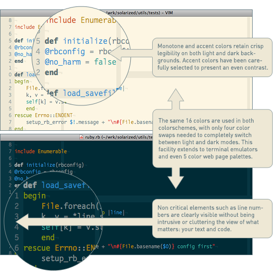

*********************
Having a usable |vim|
*********************

This may be a surprising approach for you, but for me, the first thing to do is to have a |vim| usable by a normal human being. It seems that everybody agrees that |vim| is a very **powerful editor**. And I think that you will agree too if I say that, by default, |vim| is totally unusable. Let's be honest, without a decent minimal configuration, using |vim| is **counterproductive**.

In my humble opinion, it's the first obstacle to tackle before anything else. This is what all the trendy editors like VSCode, TextMate, Sublime Text, Notepad++ or Netbeans are proposing: a default environment usable as it is, even if we don't use its full potential for now.

Here is what a default |vim| is missing (and why **most of people are giving up** before they can really see the power of |vim|):

**Default configuration**
    You can configure |vim| thanks to a file named |vimrc|. This file is, obviously, totally empty by default. The first thing to do will be to have a |vimrc| file with a minimal configuration.

**Syntax highlighting**
    By default, |vim| is white and ugly. To fix that, we will use the `Solarized theme <http://sethanschoonover.com/solarized>`_. If your goal is to be efficient, it's the best theme available out there (across all text editors), period. The beautiful image below will give you an idea of what it looks like (with the dark and the light theme). Personally, I'm using the dark theme.

    |solarized|

**File explorer**
    If you are using |vim| along with a graphical interface (I suppose it's the case for 99% of you) you will by default have a ``File`` menu available. This menu should allow you to open a file. It is, for sure, a good start. But having a file explorer a la Netbeans or Textmate can be very handy. To mimic the same behavior, we will be using `vim-fern <https://github.com/lambdalisue/vim-fern>`_. Be aware that, once you will have read this guide, you will not need the mouse anymore.

This chapter is mandatory if you have very few (or not at all) experience with |vim|. By the end of the chapter, you will have a |vim| usable on a daily basis. It should be enough to then be able to learn it gradually. Because, of course, there is no magic, you will have to practice to be able to learn |vim|, and the sooner, the better.

However, if you are already familiar with |vim| and don't use the mouse anymore, you can skip this chapter. But be sure to give *Solarized* a try, as you would be missing something otherwise.

.. _insertmode:

Essential preamble: the insert mode
===================================

Let's be totally crazy. We will try to create the |vimrc| configuration file with |vim| itself. As I said earlier, the sooner you start to use |vim|, the better. I told you it would be totally crazy!

The first thing to do will certainly be to install a |vim| version for your operating system. If you are using a Mac, give `MacVim <https://macvim.org/>`_ a try, it's the best |vim| port for Mac without a doubt. If you are using GNU/Linux or any other "Unix-like" system, you should have the command *vim* or *gVim* available directly from your terminal, or at least easily installable using your package management system (for Ubuntu, the package is called `vim-gnome`). Be sure to install the __full__ version (ie. with ruby and lua support). For Mac OS X, MacVim has already all what you need builtin. For Windows, it seems that there is a version available on the official |vim| website (http://www.vim.org/download.php), but I haven't tested it.

**Personally**, I use *vim* directly on the command line, under Archlinux, in a terminal `kitty <https://sw.kovidgoyal.net/kitty/>`_ with the Nerd Fonts `FiraCode Nerd Font <https://www.nerdfonts.com/font-downloads>`_. This is the configuration used for the screenshots in this book.

When you will start |vim|, you should see a welcome text asking you to help poor children in Uganda (or something along the lines). This text will disappear as soon as we start writing text in |vim|. 

We will start by adding a comment in the header of the file to specify the author of the document (this should be you). To be able to type text, the first thing to do will be to press |tti| (the cursor should have changed). You should get `a page`_ that looks more or less like the figure below. Note the ``--INSERT--`` at bottom left, which indicates that we're in insertion mode (the mode in which we can enter text). For the record, my terminal's theme is a dark one, so it's possible that your Vim's colors will be different for the time being.

At the time of writing, the version of Vim I'm using is ``9.1.380``.

.. _a page:

.. image:: graphics/vim-new.png

**On a side note**: if you don't really understand what you have done and |vim| is displaying red messages at the bottom left or doesn't seem to react as it should when you press |tti|, don't panic. Pressing multiples times on |ttesc| (two times should be enough) should bring |vim| to its default mode, the *Normal mode*. Then it should behave as you would expect again.

You should know be able to write down `the comment below`_ (I'll let you change my name to yours, of course 🤓):

.. _the comment below:

.. code-block:: vim

    " VIM Configuration - Vincent Jousse

You will have noticed that comments in *VimL* (the name of the |vim| programing language) start with a :viml:`"`. Then press |ttesc| to come back to the default mode (the normal mode) of |vim|. That's all, you are done. Here is a screenshot of what your |vim| should look like now:

.. image:: graphics/vim-first-comment.png

I can already hear you: all that fuss for that? Well, yes. And you even don't know how to save a file. But all these things that I'm about to explain to you are logical. One of the advantages of |vim| is that, usually, it is logical. Once you will have understood the logic behind it, all will be crystal clear for you (at least I hope so).

By default, when you start |vim|, you are presented with its default mode. This mode is called the *Normal mode*. The purpose of this mode is not to write text (for that, you will have the *Insert mode*), but only to move the cursor and to manipulate text. The power of |vim| is coming from the combination of these two modes (other modes exist, but it's not the topic for now). You will need some time and some practice to realize the power it's giving to you, so you will just need to trust me in the meantime.

If you are asking yourself why those modes exist, why can't we even write down some text by default, and why we are making things more complicated than they should be, the next chapter is for you.

.. _modes:

Modes: the powerful |vim| secrets
=================================

I suppose you will agree if I say that, if you want to learn |vim|, it's to be more efficient when writing/manipulating text or code. To be more efficient when writing text, there are not many solutions. There is only one actually: you need to move your hands as less as you can (even not at all) and only move your fingers.

To do so, of course, you will need to do without your mouse. In addition to being slow, the move keyboard -> mouse and then mouse -> keyboard is really bad for your joints. It's often the cause of musculoskeletal disorders. Maybe you are still young and don't know what I'm talking about, but believe me, you will have such problems one day or another (often sooner than you may think). If you are in front of your computer all day long, don't neglect those possible troubles, you may regret it someday. `According to Wikipedia <https://en.wikipedia.org/wiki/Musculoskeletal_disorder>`_, it's actually the most common professional disease.

You will need to forget the movement of your right hand toward the directional keys (left/right/bottom/top) too. It's a waste of time and it's completely unneeded with |vim|.

So what do you have the ability to do? Not a lot to be honest (but it's for your own good), you can only leave your hands on the home row `as you can see on the picture below`_.

.. _as you can see on the picture below:

   
   Home row, QWERTY keyboard

   Illustration by Cy21 - `CC-BY-SA-3.0 <https://www.creativecommons.org/licenses/by-sa/3.0>`_ or `GFDL <https://www.gnu.org/copyleft/fdl.html>`_, via `Wikimedia Commons <https://commons.wikimedia.org/wiki/File:Typing-home-keys-hand-position.svg>`_

You will also probably find on your keyboard some marks on the letters F and J. The goal of these marks is to give a landmark for the position of your fingers (the indexes) on the home row of the keyboard.

Trying to move as less as possible the hands from the keyboard is the reason for having a *normal* mode and an *insert* mode in |vim|. When switching from one to the other, the keys under your fingers will sometimes allow you to move the cursor and to manipulate text: copy/paste, deletion, … (it's the normal mode), sometimes they will allow you to select some text (it's the *visual mode*) and sometimes to insert some text (it's the *insert* mode). And of course, all of that is possible without the extensive use of keys combinations like *Ctrl + key* that are very bad for your fingers (*Emacs*, this one is for you).

By default, we can switch from the *insert* mode to the *normal* mode by pressing |ttesc|, but it will be one of the first things we will change: |ttesc| is to far from your fingers on current keyboards.

To switch from *normal* mode to *insert* mode, we can press |tti|. We will later learn that there are other ways to do so too. For example, to enter the *insert* mode and to then create a new line below the current one (no matter where is your cursor on the line), we will use |tto| while in *normal* mode.

I will talk again about this subject later in ":ref:`moving`", but if you are not ready, at some point, to do without your mouse and the directional keys to edit text, I would recommend you to stop learning |vim| right now. It's as simple as that. You can leverage the full power of |vim| only by getting rid of the mouse and by moving your hand as little as possible.

If you want to go further, you can buy an orthogonal keyboard like `TypeMatrix <http://www.typematrix.com>`_ or `Voyager ZSA <https://www.zsa.io/voyager>`_. It's the keyboard I'm currently using, and my fingers are thanking me everyday.

The ultimate change would be to switch your keyboard layout to a more efficient one like `Colemak <https://colemak.com/>`_, but that's another story.

The lifesaver default configuration
====================================

Let's get serious and try to have a usable |vim|. We will start by editing the default configuration file |vimrc| and by entering default values that any sane person would love to find in it.

You have to place this file in your home directory. It should be */home/your_user/.vimrc* if you are using Linux, */Users/your_user/.vimrc* if you are using Mac OS X. Generally speaking, it should be in your home directory under *~/.vimrc*. If you are using Windows, you'll need to create a file named *_vimrc* that you have to put in your *%HOME%* directory. This directory is obviously not the same across the different Windows versions. Usually, it's the directory just before your *My Documents* directory. More information is `available on Wikipedia <https://en.wikipedia.org/wiki/Home_directory#Default_Home_Directory_per_Operating_System>`_ if you want.

I've directly commented all the lines in the code itself. Nothing fancy here, you should just be asking yourself why all of this is not available by default.

.. code-block:: vim

    " VIM Configuration - Vincent Jousse
    " Cancel the compatibility with Vi. Essential if you want
    " to enjoy the features of Vim
    set nocompatible

    " -- Display
    set title                 " Update the title of your window or your terminal
    set number                " Display line numbers
    set ruler                 " Display cursor position
    set wrap                  " Wrap lines when they are too long

    set scrolloff=3           " Display at least 3 lines around you cursor
                              " (for scrolling)

    set guioptions=T          " Enable the toolbar

    " -- Search
    set ignorecase            " Ignore case when searching
    set smartcase             " If there is an uppercase in your search term
                              " search case sensitive again
    set incsearch             " Highlight search results when typing
    set hlsearch              " Highlight search results

    " -- Beep
    set visualbell            " Prevent Vim from beeping
    set noerrorbells          " Prevent Vim from beeping

For those who have done a copy/paste, you just have to save your newly created file. We want to put it in our home directory, so you have to save it as ``~/.vimrc``. When using Mac OS X and Linux, ``~`` is the home directory of the current user. But be careful, when using Linux and Mac OS X the files starting with a ``.`` are hidden files. Don't be surprised when you don't ``~/.vimrc`` in your file explorer by default.

To save it with Vim, after pressing |ttesc| to return to *Normal mode*, simply type ``:w ~/.vimrc``. To save your next changes, type ``:w`` in *Normal mode*. To save and exit ``:wq ~/.vimrc``. To exit ``:q`` and to exit without saving (force exit) ``:q!``.

I have uploaded this configuration file directly on *Github*. You can download or copy/paste it directly from:  http://vimebook.com/link/v2/en/firstconfig.

This is what |vim| should look like `after your first configuration`_.

.. _after your first configuration:

   |vim| after your first configuration.

Notice the addition of line numbers on the left.

Well, it's a good start, but we now need more colors. Let's go!

And now, the color!
===================

First, we need to enable syntax highlighting in the configuration file. Add these lines at the end of your |vimrc| configuration file

.. code-block:: vim

    " Enable syntax highlighting
    syntax enable

    " Enable file specific behavior like syntax highlighting and indentation
    filetype on
    filetype plugin on
    filetype indent on

You should have a |vim| looking like the picture below.

   Default syntax highlighting.

For the time being, the easiest way to test the modifications you made to your |vimrc| file is to restart |vim|. If you want to use |vim| like a boss right now, you can type in normal mode ``:so ~/.vimrc`` or ``:so $MYVIMRC``. It will reload the configuration without the need to restart |vim|. ``:so`` being a shortcut for ``:source``. 

This is a good first step, but now it's time to start using a theme.

Themes will allow you to have a nicer |vim| than the default one. A theme will change the background color of |vim| and the colors used for the syntax highlighting. As I said earlier, we will use the *Solarized* theme [#solarized]_ http://ethanschoonover.com/solarized (with dark or light background, it will be up to you).

.. [#solarized] Please note that we'll be using a modernized version of *Solarized* for vim and not the original version available on the author's site. This more recent version will enable it to run correctly on modern terminals. We'll install it from this fork https://github.com/ericbn/vim-solarized.

To install it, you will first need to create a directory called `.vim` in the same directory than your |vimrc| (that is to say, in your home directory). Note that when using Windows, the `.vim` directory is called `vimfiles`. Each time I'll be speaking of the `.vim` directory, it will be the `vimfiles` directory for people using Windows. In this `.vim` directory, create a sub directory named `colors`. Then, download the *Solarized* theme file https://raw.githubusercontent.com/ericbn/vim-solarized/master/colors/solarized.vim  (it's the same file for the light and the dark version) and copy it in your `vim/colors/` directory. Under Linux you can do all this with the following commands:

.. code-block:: bash

    mkdir -p ~/.vim/colors
    wget -P ~/.vim/colors https://raw.githubusercontent.com/ericbn/vim-solarized/master/colors/solarized.vim

Your `.vim` directory should look like this:

.. code-block:: bash

    .vim
    └── colors
        └── solarized.vim

Then enable the Solarized theme in your |vimrc| like shown in the code below.

.. code-block:: vim

    " Use the dark version of Solarized
    set background=dark
    " Activate 24-bits colors in the terminal
    set termguicolors
    colorscheme solarized

To test the light theme, you just have to change `dark` with `light` (for the `background` property).

Here is a preview of the two versions (personally, I prefer the dark one).

   The dark  *Solarized* theme.

   The light  *Solarized* theme.

A bonus (if you don't use |vim| directly in your terminal) would be to choose a font that suits your needs a little bit better. This is of course optional, but I suppose that some of you may wish to do this.

If you are using Mac OS X, I recommend the `Monaco` font that is quite friendly. Add the following lines to your |vimrc| to use it:

.. code-block:: vim

    set guifont=Monaco:h13
    set antialias

You can of course change `h13` with `h12` if you want a smaller font (or with `h14` if you want a bigger one).

Under Linux I am using the `DejaVu Sans Mono` font:

.. code-block:: vim

    set guifont=DejaVu\ Sans\ Mono\ 10
    set antialias

You can of course change the font size as you wish. To have the list of all the available fonts for your system type ``:set guifont:*`` in normal mode.

You will find the full version of the configuration file for this chapter online http://vimebook.com/link/v2/en/syntaxhlconfig. I will not spend more time talking about the fonts as it's dependant of your operating system and not of |vim|.

Our first plugin: the file explorer
===================================

Here we are, we have a nice |vim| that we can actually use with pretty colors. Now we need to be able to open files, which could come in handy! This will be a good opportunity to install our first plugin. We're going to do this in two steps: first, install a plugin manager to prevent your plugins from getting too messy, then install the appropriate plugin to explore a file directory.

Plugin manager: vim-plug
------------------------

`vim-plug <https://github.com/junegunn/vim-plug>`_ is typically the kind of plugin that you discover after having already configured your |vim|. Then you ask yourself, "*Why didn't I start this way?*". Fortunately, I have a good news for you: we will be starting the right way.

First of all, let's start with a little explanation about how to install plugins using |vim|. Plugins are installed by copying files (most of the time with the *\*.vim* extension) in subdirectories of your |.vim| directory. By the way, we've already created a subdirectory called `colors` that contains our first coloration plugin using the Solarize theme.

The main problem with this approach is that the plugins are not isolated. So you will have to copy files from different plugins in the same directory and you will soon not be able to know from what plugin a file is coming from. As a result, when you will want to remove or update a plugin, it will be a nightmare to know where the files are located.

That's why *vim-plug* is especially useful, it will allow each plugin to be located in a separate directory. Here is an example of a |.vim| directory before and after the usage of *vim-plug*:

.. code-block:: bash
    :caption: .vim before *vim-plug*

    .vim-
    ├── autoload
    │   └── phpcomplete.vim
    ├── colors
    │   └── solarized.vim
    └── syntax
        ├── php.vim
        └── sql.vim

.. code-block:: bash
    :caption: .vim after *vim-plug*

    .vim
    ├── autoload
    │   └── plug.vim
    └── plugged
        ├── solarized
        │   └── colors
        │       └── solarized.vim
        ├── php
        │   ├── autoload
        │   │   └── phpcomplete.vim
        │   ├── syntax
        │   │   └── php.vim
        │   └── autoload
        └── sql
            └── syntax
                └── sql.vim

You are totally right if you find that the version with *vim-plug* is using more directories. But believe me, those directories will save your life later. You will be able to easily remove and update plugins and you will be able to use *git* (or any other SCM software) to manage your plugins / submodules / dependencies.

Let's start by installing *vim-plug*. Create a directory called `autoload` in your |.vim| directory. Download `plug.vim` ( https://raw.githubusercontent.com/junegunn/vim-plug/master/plug.vim ) and copy it to your `autoload` directory. For the Unix/Mac OS X/Linux user, here is how to install it (if you don't have `curl`, you can use `wget -O -` instead:

.. code-block:: bash

    curl -fLo ~/.vim/autoload/plug.vim --create-dirs \
        https://raw.githubusercontent.com/junegunn/vim-plug/master/plug.vim

We now need to activate *vim-plug* in our |vimrc| and that's it. We'll place the code listed below at the beginning of |vimrc|, directly after the set nocompatible line. It's imperative that you place the code at the beginning of your |vimrc| file, otherwise everything won't work as expected.

.. code-block:: vim

    " Activate vim-plug
    call plug#begin()

    " Put your plugins here

    call plug#end()

Since charity begins at home, we will tidy up our install by using *vim-plug* with our *Solarized* plugin. Let's start by deleting the ``colors`` directory we created earlier where we had placed *solarized* :

.. code-block:: bash

    # Delete the colors directory
    rm -rf ~/.vim/colors

Next, let's modify our |vimrc| file to add *solarized* as a plugin (|vim| should complain that it can't find the *solarized theme*, but you can ignore the error - we're just about to install it).

.. code-block:: vim

    " Activate vim-plug
    call plug#begin()

    " Put your plugins here

    " Install solarized
    Plug 'ericbn/vim-solarized'

    call plug#end()

Our |vim| is almost ready to be used on a daily basis. We are just missing an handy way to explore the files of a project. We will use *vim-fern* for that.

Save and exit using ``:wq`` in normal mode. Restart |vim| and type ``:PlugInstall`` to install our new plugin (press |ttq| to exit the installation window). The next time you load |vim|, you should have your colors back.

.. _secvimfern:

vim-fern: a file explorer
-------------------------

*vim-fern* is a plugin that will allow you to display your directory and file tree directly in |vim|, just like in *VSCode*, *Sublime Text* or *Eclipse/NetBeans*. This is not a mandatory plugin if you want to control everything using the keyboard (I don't use it anymore myself), but it's very handy when you are starting with |vim|.

The other solution that we will see in the :ref:`plugins` chapter will be to use the *LeaderF* plugin to find files and to use the *LustyExplorer* and *LustyJuggler* plugins to navigate between the files. Indeed, having to visualize the whole file tree to find a file is a lot slower than to find a file by its name. In the meantime, The NERD Tree will allow us to use |vim| with a *normal* file explorer where you can click with the mouse.

First, we'll install *vim-fern* using *vim-plug* as before, then enable mouse use in the terminal.

.. code-block:: vim

    " Activate vim-plug
    call plug#begin()

    " Put your plugins here

    " Install solarized
    Plug 'ericbn/vim-solarized'

    " Install vim-fern
    Plug 'lambdalisue/fern.vim'

    call plug#end()

    " -- Activate the mouse
    set mouse=a

Reload your |vimrc| with the following command: ``:source $MYVIMRC`` (or save, exit and reopen |vim| as before) then install the new plugin with ``:PlugInstall`` (press |ttq| to exit the installation window).

Next, you'll need to activate the plugin. You can do this manually by typing ``:Fern . -drawer -stay`` in normal mode. If you prefer to activate *vim-fern* every time you open your |vim|, add these lines to the end of your |vimrc|:

.. code-block:: vim

    " Activate vim-fern when starting vim
    augroup FernGroup
      autocmd! *
      autocmd VimEnter * ++nested Fern . -drawer -stay
    augroup END

This is, I admit, a rather barbaric command that could be translated into good old English as: every time you open vim (``VimEnter``), regardless of the file type (``*``), run *Fern* in the current directory ``.`` in ``drawer`` mode on the side and keeping ``stay`` the focus on the current window (``Fern . -drawer -stay``).

To enable opening of directories and files on mouse click, replace the above code with :

.. code-block:: vim

    " Activate vim-fern when starting vim
    augroup FernGroup
      autocmd! *
      autocmd FileType fern call s:init_fern()

      autocmd VimEnter * ++nested Fern . -drawer -stay
    augroup END

    function! s:init_fern() abort
      nmap <buffer> <LeftRelease> <Plug>(fern-action-open-or-expand)
    endfunction

Nothing special then, *vim-fern* displays the directory tree where you launched |vim|, as shown in the screenshot below. You can use the mouse and/or keyboard to move around. Note that |ttj| allows you to scroll down, |ttk| to scroll up, |ttl| to unfold the contents of a directory or open the contents of a file, and |tth| to unfold it. Note that if you press |ttenter| on a directory, `vim-fern` will only display the contents of that directory. Simply press |ttreturn| to return to the parent directory.

   |vim| with *vim-fern* 

You can also perform various commands (create, copy files), but we won't go into detail here. You can always press |ttquestion| in the `vim-fern` window to get an overview of the commands, or visit the `official vim-fern website <https://github.com/lambdalisue/vim-fern>`_.

To switch between the *vim-fern* window and your file window with your keyboard, use ``Ctrl + w`` and then ``w``. That is to say, hold the ``Control (Ctrl)`` key and at the same time press the ``w`` key. You can then release everything and press ``w`` again. This shortcut is valid to switch between any |vim| window (it's not a shortcut specific to *vim-fern*).

The complete file of your |vimrc| at this stage is available at this address: http://vimebook.com/link/v2/en/vim-plug

Here we go
==========

Now, you've done the hardest part. Well, almost. We've just covered what is sorely lacking in |vim|: a sensible default configuration. I'm not saying that you now have the best editor out there, but at least, you should be able to use |vim| as any other *normal* text editor that you do not yet know all the possibilities. I recommend, at this stage, to start using |vim| in your everyday life. Feel free to use the mouse if needed for now. The primary goal here is to reduce the negative impact that |vim| could have on your daily productivity, if not configured properly. You will gradually learn the keyboard shortcuts when the time will come.

We will now discuss what makes the uniqueness of |vim|: the way modes are handled and the shortcuts to manipulate text. The ball is in your court now: either you are willing to change your habits and move to another level of efficiency with |vim|, or using |vim| as an improved notebook is the best option for you (in this case, you can stop here). It's up to you !
