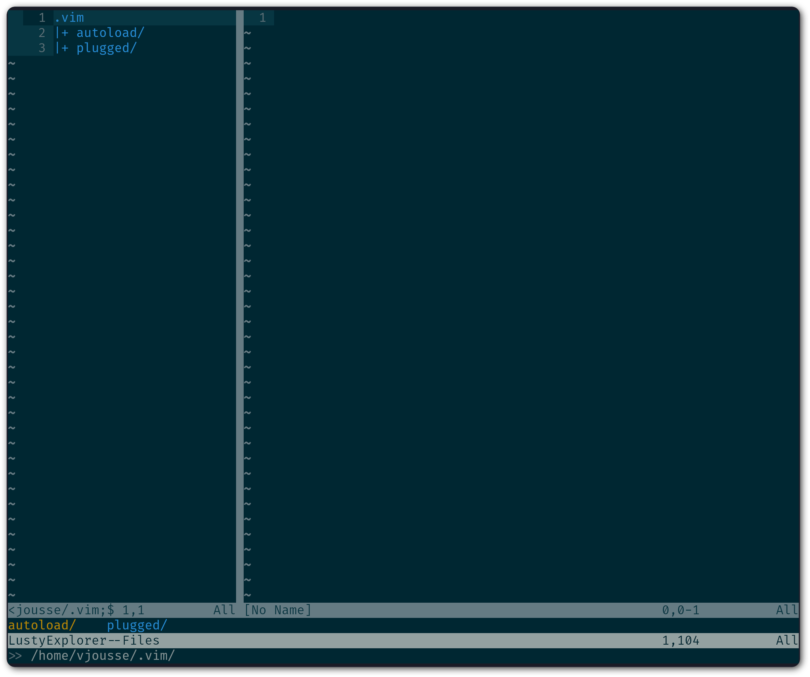
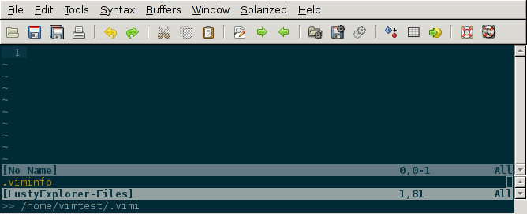
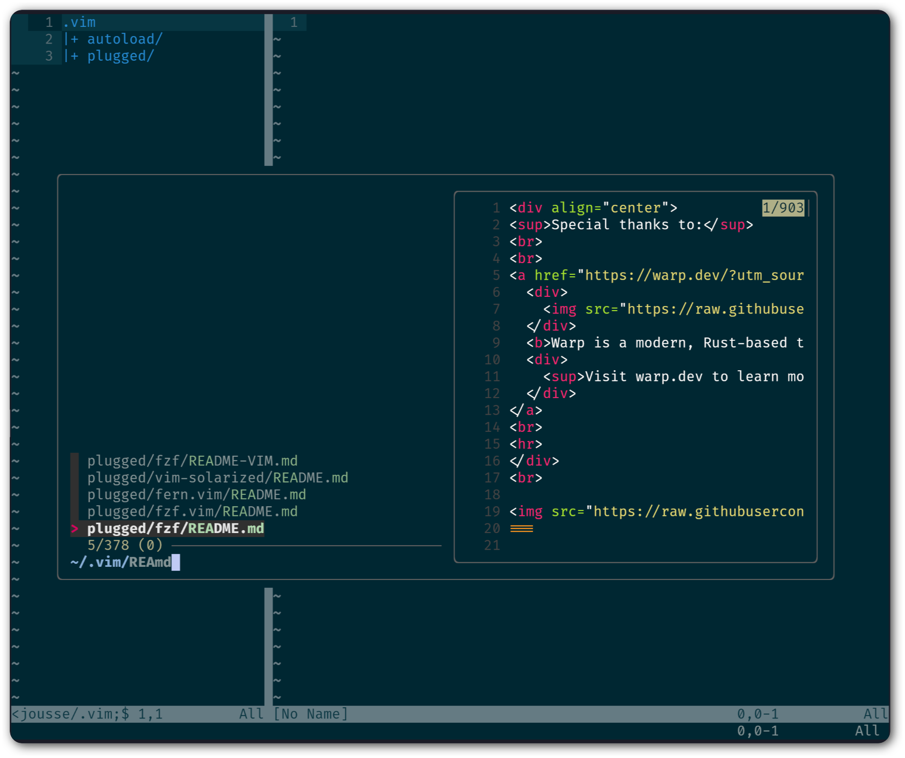
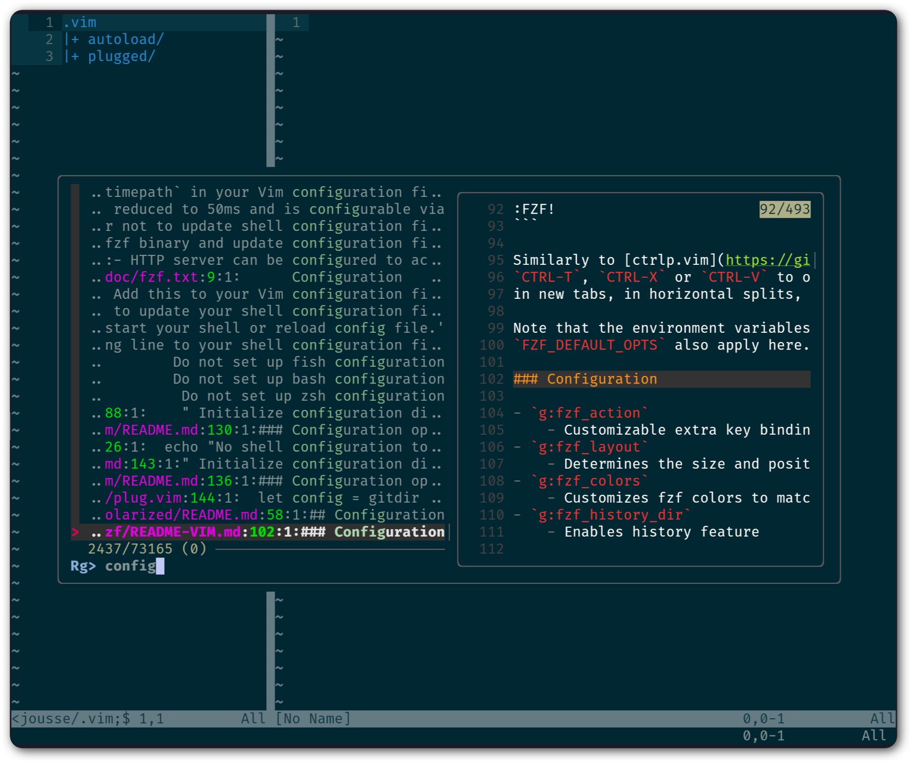
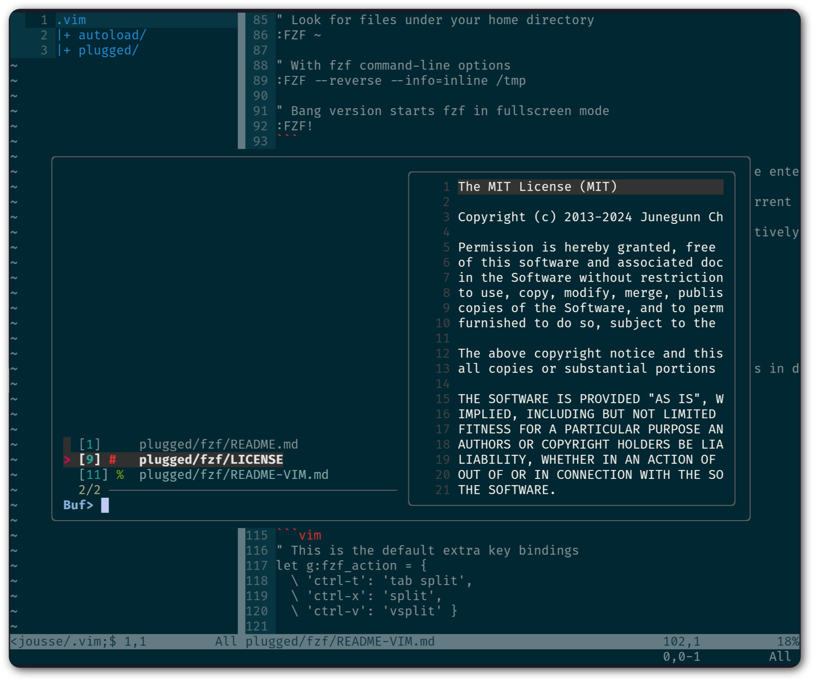

.. _plugins:

**************************
Les plugins indispensables
**************************

Soyons clair, |vim| sans ses plugins, c'est comme Milan sans Rémo (© François Corbier - Sans ma barbe - http://www.bide-et-musique.com/song/149.html) : ça ne rime à rien. C'est grâce aux plugins que |vim| va pouvoir pleinement exprimer toute sa puissance et vous élever à un autre niveau de productivité. Vous n'avez pas besoin d'en avoir des mille et des cents, mais quelques uns savamment choisis devraient faire l'affaire.

Qu'on ne se méprenne pas, |vim| peut bien sûr s'utiliser sans plugins. Il peut d'ailleurs s'avérer utile de savoir faire les manipulations de base sans avoir besoin d'installer de plugin, car c'est souvent le cas sur des serveurs : il n'y a aucun plugin d'installé. Dans ce cas là, savoir ouvrir, sauvegarder sous, passer d'un fichier à l'autre avec les commandes de |vim| par défaut peut vous sauver la mise. En revanche, dans votre travail quotidien de rédaction ou de code, les plugins sont indispensables pour pleinement tirer partie de |vim|.

.. _seclusty:

Naviguer sur le disque et entre les fichiers : *Lusty Explorer*
===============================================================

Nous avons déjà vu `vim-fern` dans :ref:`secvimfern` qui permettait d'avoir un explorateur de projet dans une fenêtre latérale de |vim|. Le problème de ce plugin est qu'il n'est pas fait pour être utilisé au clavier. Certes vous pouvez utiliser le clavier, mais il ne sera pas aussi efficace que les plugins pensés uniquement pour une utilisation au clavier.

Personnellement, le premier plugin que j'installe partout où j'ai à utiliser |vim|, c'est *Lusty Explorer* (http://www.vim.org/scripts/script.php?script_id=1890). Ce plugin va vous permettre de naviguer sur votre disque dur pour ouvrir facilement des fichiers en se passant de la souris. Il va aussi permettre de naviguer rapidement entre vos différents fichiers déjà ouverts (vos buffers en jargon |vim|). Commençons par l'installer via *vim-plug*. Comme d'habitude, ajoutez la ligne ci-dessous à la suite des plugins déjà listés dans votre |vimrc| :

.. code-block::

    " Installation de Lusty Explorer
    Plug 'sjbach/lusty'

Reste maintenant à voir comment l'utiliser. Si l'on se réfère à la documentation, voilà ce que l'on trouve (traduit en français) :

.. code-block:: html

    <Leader>lf  - Ouvre l'explorateur de fichiers.
    <Leader>lr  - Ouvre l'explorateur de fichiers à partir du répertoire du fichier courant.
    <Leader>lb  - Ouvre l'explorateur de buffers.
    <Leader>lg  - Ouvre la recherche dans les buffers.

On voit qu'il est fait mention d'une touche nommée |tleader| qu'il faut ensuite faire suivre d'autres touches comme *lf*, *lr*, *lb* et *lg*. Cette touche |tleader| est une touche spéciale que l'on définit dans son fichier |vimrc|. Elle sera énormément utilisée par tous les plugins, beaucoup des commandes de ces derniers commenceront par la touche |tleader|. C'est un moyen d'éviter les collisions avec les raccourcis par défaut de |vim|.

Il faut donc choisir une touche |tleader|. Par défaut, |vim| utilise ``\`` comme touche |tleader|. Sur nos claviers francophones c'est une très mauvaise idée d'utiliser cette touche car elle n'est pas pratique du tout. La plupart des utilisateurs de |vim| la remplace par la touche |tcomma|. Elle est directement accessible sous l'index de la main droite ce qui en fait une parfaite candidate. Pour spécifier cela à |vim| il va falloir rajouter une ligne dans votre fichier |vimrc|, à savoir : ::

    let mapleader = ","

Une fois la modification effectuée et prise en compte (en redémarrant |vim| ou en tapant ``:so ~/.vimrc`` ou ``:so $MYVIMRC`` en mode normal), vous devriez être en mesure de taper ``,lr`` et d'avoir le même style de résultat que sur la figure ci-dessous (notez l'affichage du contenu de votre dossier actuel en bas à gauche).

.. _la capture d'écran de lusty: lusty_

.. _lusty:

Vous pouvez constater sur `la capture d'écran de lusty`_ qu'il y a deux parties à *Lusty Explorer*. La partie basse vous indique le répertoire que vous êtes en train d'explorer et la partie haute liste le contenu de ce répertoire. En surbrillance se trouve l'élément couramment sélectionné. Dans le cas de `la capture d'écran de lusty`_ c'est le répertoire ``.autoload/`` en jaune  (la couleur pourra être différente en fonction de votre thème).

*Lusty Explorer* utilise une fonctionnalité de *Fuzzy matching* qui va vous permettre de ne taper qu'une partie d'un nom de fichier ou de répertoire pour le sélectionner. Dans mon exemple, si, dans la fenêtre de *Lusty*, je saisi ``pl`` il va me sélectionner le répertoire ``plugged/`` sans que j'ai à lui spécifier le nom entier, je n'aurai ensuite plus qu'à appuyer sur |ttenter| pour ouvrir le fichier dans |vim|. La figure suivante vous montre l'exemple en question.

.. _fuzzy:

*Lusty Explorer* dispose en plus de quelques raccourcis bien pratiques pour utiliser le navigateur de fichiers :

* |tctrl| + |tn| pour sélectionner le fichier/répertoire suivant
* |tctrl| + |tp| pour sélectionner le fichier/répertoire précédent
* |tctrl| + |tw| pour descendre au répertoire parent
* |tctrl| + |te| crée un nouveau fichier vide (non sauvegardé sur le disque) avec le nom spécifié actuellement dans *Lusty Explorer*. Vous n'aurez plus qu'à utiliser ``:w`` pour écrire le contenu du fichier sur le disque.

*Lusty Explorer* s'utilise donc pour deux choses : naviguer sur votre système de fichiers avec ``,lr`` et ``,lf``, et naviguer entre vos fichiers ouverts (buffers) avec ``,lb``. Personnellement j'utilise moins la recherche dans les buffers avec ``,lg``, à vous de tester et de vous faire votre propre opinion.

Je vous conseille en guise de test d'ouvrir plusieurs fichiers avec ``,lr`` ou ``,lf``. Ensuite, entraînez-vous à naviguer entre ces différents fichiers ouverts en même temps à l'aide de ``,lb``. C'est une des combinaisons que j'utilise le plus au quotidien.

Ce plugin est indispensable et ajoute à lui seul énormément de valeur à |vim| : se passer de la souris pour ouvrir des fichiers. Prenez donc le temps nécessaire pour l'apprendre correctement, c'est un investissement qui vaut le coup.

Recherche de fichiers, de chaînes de caractères et d'un peu tout : *fzf*
========================================================================

Dans le monde informatique il existe un moyen très efficace pour rechercher des choses dont on connait « à peut prêt » le nom, on appelle ça le **Fuzzy Matching** (*recherche approximative* ou *recherche floue* en français, cf https://fr.wikipedia.org/wiki/Recherche_approximative). Cette technique va nous permettre de trouver des fichiers dont on connait une partie du nom, ou alors une partie du répertoire parent et une partie du nom par exemple. Elle va aussi nous permettre de faire la même chose pour le contenu des fichiers : pas besoin d'être très précis (majuscules, minuscules, accents, etc) le **Fuzzy Matching** nous retournera ce qui se rapproche le plus du terme que l'on recherche.

`fzf <https://github.com/junegunn/fzf>`_ est la référence dans le domaine : il permet de faire du **Fuzzy Matching** un peu partout et notamment avec vim (ça tombe bien hein 🤓) !

Installation de *fzf*
---------------------

Ajoutez ces deux lignes à vos plugins dans votre |vimrc| pour installer *fzf* et le plugin |vim| correspondant : ::

    " Installation de fzf
    Plug 'junegunn/fzf', { 'do': { -> fzf#install() } }
    Plug 'junegunn/fzf.vim'

Puis ajoutez ces mappings plus bas dans votre fichier (n'importe où après le ``call plug#end()``) : ::

    " On recherche dans les fichiers du répertoire courant
    nmap <silent> <Leader>ff :Files<CR>
    " On recherche dans les buffers ouverts
    nmap <silent> <Leader>fb :Buffers<CR>
    " On recherche dans le contenu des fichiers
    nmap <silent> <Leader>fr :Rg<CR>

Comme d'habitude, pour prendre en compte ces modifications, tapez ``:so ~/.vimrc`` ou ``:so $MYVIMRC`` en mode normal puis ``:PlugInstall`` pour installer les deux plugins.

Recherche de fichiers par nom
-----------------------------

Tapez ``,ff`` en mode normal (ou ``:Files``) et vous devriez voir une fenêtre similaire à la capture d'écran suivante s'ouvrir : fzf-files_

.. _fzf-files:

En fonction d'où vous avez ouvert votre |vim|, les résultats seront bien sûr différents. Je l'ai pour ma part ouvert dans le répertoire ``.vim``. Vous pouvez noter que j'ai juste tapé `REAmd` et qu'il a automatiquement trouvé tous les fichiers nommées `README.md`. Il a même mis en surbrillance dans les noms de fichiers ce qui a permis de faire la correspondance, dans notre cas le `REA` au début du nom du fichier puis le `md` dans l'extension du fichier.

Vous pouvez naviguer dans les résultats de recherche avec les raccourcis |vim| par défaut, à savoir ``Ctrl-k`` pour bouger la sélection d'une ligne au dessus et ``Ctrl-j`` pour bouger la sélection d'une ligne en dessous. Il suffira ensuite d'appuyer sur |ttenter| pour ouvrir le fichier sélectionné. Vous noterez l'aperçu du fichier à droite de la fenêtre qui s'est ouverte. Vous pouvez naviguer dans cet aperçu grâce à ``Shift-haut`` et ``Shift-bas`` (eh oui, pas de raccourci |vim| pour cette fonction !)

Recherche de chaînes de caractères dans les fichiers
----------------------------------------------------

Pour rechercher dans les fichiers nous allons utiliser un outil nommé `rg` (pour `ripgrep`). Assurez-vous donc de l'avoir installé, les instructions sont disponibles sur le `github de rg <https://github.com/BurntSushi/ripgrep#installation>`_. Si vous ne connaissez pas `ripgrep`, il est grand temps de remplacer votre traditionnel `grep` par `rg` : il est beaucoup plus performant et globalement bien mieux fichu.

Une fois `rg` installé, tapez ``,fr`` en mode normal (ou ``:Rg``) et vous devriez voir une fenêtre similaire à :ref:`la capture d'écran suivante<fzf-rg>` s'ouvrir :

.. _fzf-rg:

Dans mon exemple, *fzf* a trouvé le texte *config* au sein du fichier ``README-VIM.md`` dans le titre ``### Configuration``.

Recherche dans les noms de buffers
----------------------------------

Tapez ``,fb`` en mode normal (ou ``:Buffers``) et vous devriez voir une fenêtre similaire à :ref:`la capture d'écran suivante<fzf-buffers>` s'ouvrir :

.. _fzf-buffers:

Vous noterez que j'avais pour ma part 3 fichiers (buffers) ouvertse et vous aurez remarqué que cette fonctionnalité est similaire à celle déjà présente dans `LustyExplorer`. À vous de choisir celle que vous préférez !

Les plugins avancés
===================

J'aurais pu faire un livre entier qui recense les plugins |vim|, mais je pense que l'intérêt aurait été assez limité. Je ne vais donc pas vous décrire plus en détails d'autres plugins, ceux que je vous ai présentés jusqu'ici devraient vous suffir pour utiliser |vim| de manière efficace ! En revanche je vous donne ci-dessous une liste de plugins qui pourraient vous intéresser. Cette liste est issue d'un sondage que j'avais effectué sur Twitter demandant à mes followers quels étaient les plugins |vim| indispensables selon eux. La voici :

* **coc.vim**. C'est un plugin qui va transformer votre |vim| en IDE complet à la VSCode : auto-complétion des fonctions, des classes, « allez à la définition », etc. Même si la tendance est à utiliser des `plugins plus simples qui s'intègrent avec des LSP (Language Server Protocol) directement <https://github.com/prabirshrestha/vim-lsp>`_, *coc.vim* a l'avantage d'être complet, testé et de s'appuyer sur les configurations similaires à VSCode. Il a aussi le désavantage d'utiliser javascript. Le repo Github : https://github.com/neoclide/coc.nvim.
* **surround**. Ce plugin permet de gérer (changer, ajouter, supprimer) tout ce qui « entoure » : les parenthèses, les crochets, les guillemets … Par exemple vous pourrez en une combinaison de touches changer "Hello world!" en 'Hello world!' ou <q>Hello world!</q>. Le repo Github : https://github.com/tpope/vim-surround.
* **fugitive**. Si vous travaillez sur du code source vous utilisez forcément un gestionnaire de version de code source. Si ce n'est pas le cas vous pouvez aller vous cacher. Sinon si vous utilisez Git, Le plugin fugitive est pour vous. Il permet de gérer git directement dans |vim|. Le repo Github :  https://github.com/tpope/vim-fugitive
* **ALE**. ALE vérifie pour vous la syntaxe de votre code source. Il va, comme peut le faire VSCode par exemple, vous afficher vos erreurs de syntaxe directement dans |vim|. Peut vous faire gagner un temps certain si vous éditez souvent du code. Si vous voulez l'utiliser avec *coc.vim*, assurez vous de mettre ``"diagnostic.displayByAle": true`` dans votre ``:CocConfig`` `comme mentionné dans le dépôt Github <https://github.com/dense-analysis/ale?tab=readme-ov-file#cocnvim>`_ de ALE. Le repo Github est par ici : https://github.com/dense-analysis/ale

