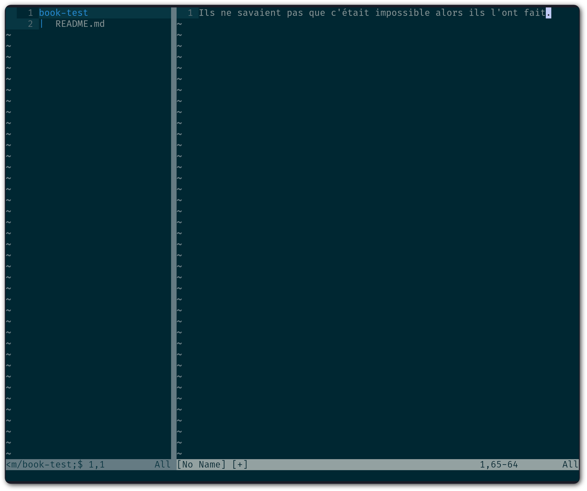
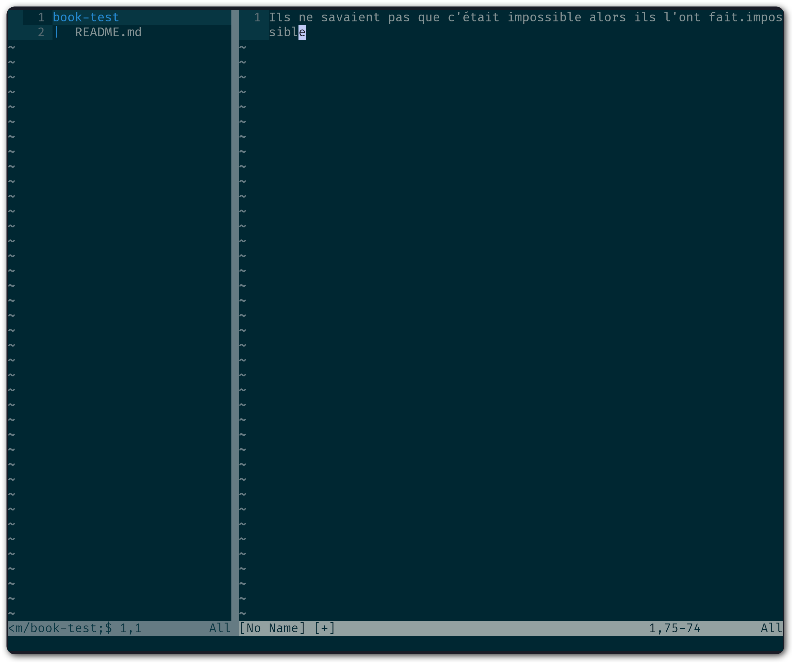

*************************************
L'outil de manipulation de texte rêvé
*************************************

Alors oui, pour ceux qui se demandent, je fais des rêves bizarres, mais bon, chacun a ses petites tares cachées. Et rêver d'un outil qui améliore ma vie quotidienne en tant que codeur (ou écrivain, ou formateur, ou …) n'est pas si étrange que ça.

Ce qui fait et fera encore le succès de |vim| est sa capacité à **faciliter les manipulations de texte**. Certes il va vous proposer des fonctionnalités propres à chaque tâche que vous effectuerez (souvent par l'intermédiaire de plugins) comme la validation syntaxique de code, la correction orthographique, … Mais à la fin, c'est toujours à écrire/corriger/manipuler/se déplacer dans du texte que vous passerez la majeure partie de votre temps. 

C'est là que l'approche de |vim| est différente d'IDE comme VSCode / Eclipse / Netbeans / PhpStorm et consorts. Là où ces IDE vont mettre l'accent sur les particularités de votre langage de programmation tout en vous fournissant des capacités de manipulation de texte basiques, |vim| adopte l'approche opposée : vous serez **très efficace** à manipuler/écrire du texte quel qu'il soit et vous pourrez enrichir |vim| avec des fonctionnalités propres à votre langage de programmation via des plugins.

Nous allons donc voir dans ce chapitre comment utiliser |vim| à bon escient (vous allez commencer à oublier votre souris) et quelle est la logique derrière tous ces enchaînements de commandes qui paraissent barbares au non-initié. Vous devriez pouvoir, à la fin de ce chapitre, **vous passer de votre souris** pour éditer/manipuler le contenu d'un fichier. En tout cas, vous devriez vous forcer à le faire en apprenant |vim|, ce n'est pas si dur que ça, et c'est ce qui fait la différence entre |vim| et les autres : le tout clavier.

.. _se-deplacer:

Se déplacer par l'exemple : Essayer de copier / coller
======================================================

Nous avons déjà vu dans la section « :ref:`modeinsertion` » comment passer du mode insertion (pour saisir du texte) au mode normal (*a priori* pour l'instant, vous ne savez pas trop à quoi sert ce mode). En appuyant sur |tti| votre curseur passe en mode insertion (lorsque vous êtes en mode normal) et en appuyant sur |ttesc| il repasse dans le mode normal. Bon bah on est bien Tintin. Et maintenant ? 

Préambule
---------

Nous allons apprendre notre première manipulation de texte : le copier / coller. J'en vois certains d'entre vous se dire que ça ne sert à rien, car vous savez déjà le faire. Vous passez en mode insertion, vous prenez votre souris (ou vous vous déplacez avec les flèches directionnelles tout en appuyant sur |ttshift|) pour sélectionner du texte et vous allez dans le ``menu Édition`` de votre terminal puis ``Copier``. Et ensuite ``menu Édition`` puis ``Coller``. Bah tiens, essayez pour voir.

Si vous avez suivi la section « :ref:`modes` » traitant de la position idéale pour vos mains, vous savez que vous avez fait une ou plusieurs choses que vous devriez vous interdire :

- Vous avez utilisé votre souris
- Vous avez déplacé grandement votre main droite de sa position de repos, pour aller atteindre les flèches directionnelles qui sont très mal placées sur un clavier

Alors certes ce n'est pas grave en soi, mais c'est **inefficace** (se servir de la souris ou déplacer votre main droite vers les touches directionnelles est très lent) et **nuisible** pour vos petites mains. Ceci est votre dernière chance : si vous n'êtes pas prêt à vous forcer à ne pas le faire, **Vim n'est pas fait pour vous**. |vim| est parfait pour ne pas utiliser la souris et pour ne pas bouger vos mains (ou presque). Ne pas se forcer à le faire, c'est ne pas tirer partie de tout le potentiel de |vim|, et à un moment ou un autre, **vous le quitterez pour un éditeur** qui aura été pensé pour être utilisé à la souris. Alors, on continue ?

Se passer de la souris
----------------------

Si vous lisez ces lignes c'est que vous avez répondu « oui », allons-y gaiement alors ! Nous allons tout d'abord commencer par nous passer de la souris. La prochaine étape sera de se passer des touches directionnelles, mais chaque chose en son temps.

Pour réaliser un copier/coller avec |vim| tout se passe en mode « normal ». Pour savoir dans quel mode vous vous trouvez, vous avez juste à regarder en bas à gauche de votre |vim|. La `figure ci-dessous`_ vous montre |vim| en mode « insertion » par exemple. 

.. _figure ci-dessous: `mode insert`_

.. _mode insert:

.. image:: ../../book-tex/graphics/vim-insert.png

Lorsque rien n'est marqué en bas à gauche, c'est que vous êtes en mode normal. Pour sortir d'un mode afin de retourner au mode normal, il suffit d'appuyer sur |ttesc|. À noter que si vous vous demandez pourquoi je vous dis d'arrêter d'utiliser la souris et/ou les touches directionnelles, mais que je ne dis rien sur le fait qu'il faille se torturer la main pour atteindre |ttesc|, c'est que vous êtes sur la bonne voie. Je vous explique le comment du pourquoi dans « :ref:`secesc` ».

Admettons donc que vous êtes en mode « normal » et que vous avez un peu de texte de saisi dans votre |vim| (inséré par vous même grâce à un passage par le mode insertion avec |tti| puis retour au mode normal avec |ttesc|). Par exemple, cette chouette citation de Mark Twain : « Ils ne savaient que c'était impossible, alors ils l'ont fait. ». Votre |vim| devrait ressembler à celui de la figure ci-dessous. Notez l'absence d'affichage d'un quelconque mode en bas à gauche, c'est donc que l'on est en mode *normal*.

.. _twain:

La façon la plus naturelle (mais pas la plus efficace, nous verrons cela un peu plus loin) de copier/coller le mot « impossible » va être de se déplacer sur la première lettre du mot avec les touches directionnelles, d'appuyer sur |ttv| (pour passer en mode « visuel »), de se déplacer sur la dernière lettre (vous devriez avoir le mot sélectionné, en surbrillance) puis d'appuyer sur |tty| (|tty| étant utilisée comme raccourci du mot *yank* en anglais qui veut dire *extraire*). Vous avez copié votre premier mot.

Déplacez vous ensuite à la fin de la phrase avec les flèches (toujours en mode « normal ») puis appuyez sur |ttp| (raccourci du mot *paste* cette fois-ci pour *coller*). Le mot devrait avoir été collé à la fin, et vous devriez avoir le même rendu que la figure qui suit.

.. _vim-paste:

On se rend donc compte ici que |vim| se sert de l'astuce des modes (et notamment du mode « normal » pour les déplacements) afin de ne pas avoir à se servir de la souris.
À partir du moment où vous aurez pris l'habitude de passer rapidement d'un mode à l'autre (et pour cela se passer de |ttesc| va devenir indispensable), utiliser la souris vous apparaîtra comme une perte de temps, mais pour cela il va falloir pratiquer un peu bien sûr.

.. _secse-passer-touches-dir:

Se passer des touches directionnelles
=====================================

Nous y voilà. Encore plus que de se priver de la souris, se priver des touches directionnelles est la chose à faire si l'on veut utiliser |vim|, pour de vrai. |vim| va vous permettre de faire tout plus rapidement et plus intuitivement à la seule condition de le faire sans les touches directionnelles.
Cela va vous permettre comme je l'ai déjà dit de ne pas bouger votre main certes, mais ça va aussi vous forcer à passer en mode « normal » pour réaliser vos déplacements et vos mouvements de texte. Il n'y a qu'à ce moment là (un peu douloureux au début il est vrai) que vous commencerez à vraiment tirer parti de |vim|.

Pour cette section, je vais vous expliquer comment vous déplacer sans utiliser les touches directionnelles. Puis, une fois que vous aurez une vague idée de comment faire, je vous donnerai le code à mettre dans votre |vimrc| pour désactiver les touches directionnelles complètement. Car oui, il n'y a que comme ça que vous y arriverez (en tout cas il n'y a que comme ça que j'y suis arrivé).

Se déplacer sans les touches directionnelles
--------------------------------------------

En mode normal, 4 touches vont vous permettre de déplacer le curseur d'un caractère :

* |tth| pour aller **à gauche**
* |ttj| pour aller **en bas**
* |ttk| pour aller **en haut**
* |ttl| pour aller **à droite**

.. _hjkl:

.. image:: ../../book-tex/graphics/hjkl.png

Vous pouvez remarquer que ces touches sont placées sur la rangée de repos de manière à déplacer vos doigts le moins possible. En essayant de placer vos doigts pour atteindre ces lettres vous devriez vous rendre compte que l'index a deux déplacements (gauche et bas) alors que l'auriculaire n'en a pas. Vous verrez qu'on s'y fait assez rapidement et que l'index étant plus fort que l'auriculaire, ça tombe plutôt bien. Vous trouverez le clavier sur lequel *Vi* a été conçu dans la section « :ref:`secesc` », vous comprendrez ainsi le pourquoi du comment.

À noter qu'à force, on se sert de moins en moins des déplacements gauche/droite d'un caractère. On va leur préférer les déplacements de mot en mot, de paragraphe en paragraphe ou les déplacements grâce à des recherches. Quelques exemples de déplacements "rapides" que j'utilise :

========== ===============================================
Touche     Déplacement
========== ===============================================
|te|       **à la fin du mot courant**
|tb|       **au début du mot courant**
|tw|       **au début du mot suivant**
|that|     **au premier caractère non blanc de la ligne**
|tdollar|  **à la fin de la ligne**
|tzero|    **au début de la ligne**
========== ===============================================

Vous avez ici le minimum pour vous déplacer en mode normal. Il existe aussi des commandes vous permettant de vous déplacer puis de rentrer en mode insertion directement, elles sont très pratiques car elles vont vous permettre d'économiser quelques touches. En voici quelques unes que j'utilise à peu près tout le temps :

======== ================================================================
Touche   Action
======== ================================================================
|ti|     se place en mode insertion **avant l'emplacement du curseur**
|ta|     se place en mode insertion **après l'emplacement du curseur**
|tI|     se place en mode insertion **au début de la ligne**
|tA|     se place en mode insertion **à la fin de la ligne**
|to|     insère une nouvelle ligne **en dessous de la ligne courante**
|tO|     insère une nouvelle ligne **au dessus de la ligne courante**
|tr|     **remplace les caractères** sous le curseur
======== ================================================================

Arrêtons-nous un peu là dessus. Au risque d'insister lourdement, mais la clé de l'utilisation de |vim| vient de ce que nous venons de voir dans ce chapitre, ni plus, ni moins. Il y a une chose que vous avez à vous forcer à faire, c'est **d'utiliser les touches hjkl** pour les déplacements. Si vous y arrivez, vous apprendrez tout le reste au fur et à mesure.

Vous trouverez des sites entiers vous détaillant les différentes commandes possibles, les différentes combinaisons, j'en passe et des meilleures. Vous les apprendrez puis les oublierez (ou pas, en fonction de si elles vous sont vraiment utiles). Si vous avez un seul effort à faire c'est celui de se passer des touches directionnelles et donc de vous forcer à utiliser le mode normal. Le reste tombera sous le sens.

Voici l'ultime configuration qu'il vous faudra mettre dans votre |vimrc| pour atteindre le Saint Graal : désactiver les touches directionnelles. ::

    " Désactivation des touches directionnelles
    map <up> <nop>
    map <down> <nop>
    map <left> <nop>
    map <right> <nop>
    imap <up> <nop>
    imap <down> <nop>
    imap <left> <nop>
    imap <right> <nop>

Nous y voilà. Croyez-moi, vous allez souffrir un peu au début. Pour moi, ça n'a pas duré plus de deux jours. Ensuite vous aurez oublié. Si vous n'êtes pas prêt à galérer un peu pendant deux jours pour améliorer votre efficacité à vie, que faites-vous ici !

Je ne vous donnerai pas d'autres détails sur toutes les touches possibles pour vous déplacer, d'autres ressources le font déjà bien mieux que moi. Je vais en revanche vous apprendre dans :ref:`combine-move` comment les utiliser à bon escient.

On peut notamment citer le livre gratuit "A byte of |vim|" disponible à l'adresse suivante : https://vim.swaroopch.com/ (malheureusement sa traduction en français a disparu depuis la première version de ce livre).

Ou encore l'infographie de la figure ci-dessous (téléchargeable sur https://github.com/vjousse/vim-for-humans-book/blob/master/book-tex/graphics/vi-vim-cheat-sheet.png) qui donne un aperçu des différents mouvements pour chacune des touches d'un clavier français.

.. _cheat-sheet:

.. image:: ../../book-tex/graphics/vi-vim-cheat-sheet.png

N'oubliez pas que le but ici est de gagner en rapidité en ne bougeant quasi plus ses mains de la rangée de repos, et en utilisant le plus possible le « mode normal ». Au boulot !

.. _secesc:

Se passer de la touche Échap
============================

Utiliser |ttesc| pour sortir du mode « insertion » semble être une hérésie tellement elle est difficilement accessible. Il faut déplacer entièrement la main gauche pour y accéder ou alors se torturer le petit doigt.

Pour comprendre pourquoi |ttesc| est utilisée par défaut, il faut faire un bon de quelques années en arrière, pour se retrouver en face du clavier sur lequel *Vi* a été développé. Vous pouvez voir sur la photo ci-dessous que |ttesc| était très facilement accessible. Vous pouvez aussi noter l'emplacement des touches directionnelles. Malheureusement depuis, cela a bien changé.

.. _vi-keyboard:

.. image:: ../../book-tex/graphics/lsi-adm3a-full-keyboard.jpg

L'étape ultime (après avoir réussi à se passer des touches directionnelles) est donc de rapprocher |ttesc| de vos petits doigts. Il y a plusieurs solutions pour cela, mais celle que je vous recommande si vous avez un clavier avec une disposition française est la suivante (dans votre |vimrc|) :::

    " On attribue ;; à la touche <Esc>
    " Les ; sont rarement utilisés l'un à la suite de l'autre
    :imap ;; <Esc>
    :map ;; <Esc>

Lorsque vous êtes en mode insertion, il vous suffit d'appuyer deux fois sur |ttsemicolon| pour retourner au mode normal. |ttsemicolon| ne vous demande pas de bouger votre main de la rangée de repos et on l'utilise rarement deux fois de suite (et si c'est le cas, il suffit d'attendre un peu avant de taper le deuxième |tsemicolon|), c'est donc le parfait candidat.

Voici d'autres solutions possibles (cf https://vim.fandom.com/wiki/Avoid_the_escape_key):::

    :imap jj <Esc>

    :imap jk <Esc>

    :imap ii <Esc>

    :imap ` <Esc>

    " Shift-Espace (peut ne pas marcher sur votre système).
    :imap <S-Space> <Esc>

    " Sous Linux avec gvim Vim en console, vous pouvez utiliser Alt-Space.
    :imap <M-Space> <Esc>

.. _combine-move:

Combiner des touches/déplacements
=================================

Maintenant que nous savons nous déplacer en mode normal, il est temps de voir comment réaliser d'autres opérations. Nous avons déjà vu le copier/coller au chapitre :ref:`se-deplacer`, nous allons maintenant voir comment supprimer/éditer plus facilement.

Dans :ref:`secse-passer-touches-dir` nous avons vu qu'il suffisait d'utiliser |ttw| pour se déplacer au début du mot suivant. Nous allons essayer de combiner cela avec quelques nouvelles touches du mode normal :

* |ttd| est utilisée pour « supprimer »
* |ttc| est utilisée pour « supprimer et passer en mode insertion »

À noter que ce qui est supprimé est placé dans le presse-papier en même temps (le « supprimer » se comporte par défaut comme un « couper »).

La particularité de ces touches, c'est qu'elles attendent ensuite un « ordre de déplacement » pour savoir quoi supprimer. Il va donc falloir les combiner avec les déplacements que nous avons déjà vus dans :ref:`secse-passer-touches-dir`.

Cela donnera par exemple :

======================= ============================================================================
Action                  Résultat
======================= ============================================================================
|ttd| puis |ttw|        supprime les caractères jusqu'au prochain mot
|ttc| puis |ttw|        supprime les caractères jusqu'au prochain mot et passera en mode insertion
|ttd| puis |ttdollar|   supprime tout jusqu'à la fin de la ligne
|ttd| puis |tthat|      supprime tout jusqu'au début de la ligne
======================= ============================================================================

Vous pouvez aussi utiliser cela pour copier :

======================= =============================================================
Action                   Résultat
======================= =============================================================
|tty| puis |ttw|        copie les caractères jusqu'au prochain mot
|tty| puis |ttdollar|   copie tout jusqu'à la fin de la ligne
|tty| puis |tthat|      copie tout jusqu'au premier caractère non blanc de la ligne
======================= =============================================================

Il ne vous restera qu'a appuyer sur |ttp| pour coller ce que vous voulez où vous voulez. Par défaut |ttp| colle le texte après la position courante du curseur. Si vous voulez coller avant la position du curseur, utilisez |ttP|.

Il arrive de temps en temps de vouloir aussi supprimer du texte (non sans blague !), voici quelques commandes utiles pour cela :

========= ============
Action    Résultat
========= ============
|tdtd|    efface la ligne courante et la place dans le presse-papier
|tx|      efface le caractère sous le curseur
|tX|      efface le caractère avant le curseur
========= ============

La plupart des mouvements peuvent être préfixés par un nombre multiplicateur. Voici quelques exemples :

================= ============
Action            Résultat
================= ============
``2``\ |td|\ |td| efface deux lignes
``3``\ |tx|       efface 3 caractères vers l'avant du curseur
``3``\ |tX|       efface 3 caractères vers l'arrière du curseur
``2``\ |ty|\ |ty| copie 2 lignes dans le presse-papier
``5``\ |tj|       se déplace de 5 lignes vers le bas
================= ============

Rechercher / Se déplacer rapidement
===================================

Maintenant que nous connaissons les commandes de base pour éditer du texte avec |vim|, voyons voir comment nous déplacer plus rapidement dans notre document. Nous avons déjà évoqué les touches |tw|, |tb|, |that| et |tdollar| qui nous permettent respectivement de se déplacer à la fin d'un mot, au début d'un mot, au début d'une ligne et la fin d'une ligne. Tout d'abord, voyons voir comment « scroller » sans la souris. À noter que toutes ces commandes se font en mode « normal ».

Sauts de page
-------------

Pour faire défiler les pages, il faut utiliser :

* |tctrl| + |tf| pour passer à la page suivante (|tf| pour forward)
* |tctrl| + |tb| pour passer à la page précédente (|tb| pour backward)

Ces raccourcis vont vous permettre d'avancer rapidement dans votre document. 

Vous pouvez aussi :

* Vous rendre au début du fichier en tapant |tgtg|
* Vous rendre à la fin du fichier en tapant |tG|
* Vous rendre à la ligne 23 en tapant |tcolon|\ ``23``

Les marqueurs
-------------

Lorsque je me déplace dans un fichier, j'aime bien pouvoir revenir à certains endroits. Par exemple lorsque je me rends au début du fichier alors que j'étais en train de travailler au milieu de celui-ci, j'aime bien pouvoir revenir directement où je travaillais. Heureusement, |vim| a tout prévu pour cela grâce à l'utilisation de **marqueurs**. Les marqueurs sont tout simplement des « marque-pages » qui permettent à votre curseur de se retrouver à la position où vous aviez mis votre marqueur.

Un marqueur se pose en tapant |tm|\ |ta|. Pour déplacer votre curseur à la position du marqueur tapez |tapos|\ |ta|. Vous pouvez placer plusieurs marqueurs en changeant |ta| par n'importe quelle lettre de l'alphabet (on appelle cela des registres en langage |vim|). Pour placer un autre marqueur vous pouvez par exemple utiliser la lettre |td|. Grâce à |tm|\ |td| vous placerez le marqueur et à |tapos|\ |td| vous vous y rendrez.

La recherche
------------

En mode normal, vous pouvez lancez une recherche en utilisant |ttslash| suivi du texte que vous souhaitez rechercher puis de |ttenter|. Grâce à notre configuration de |vim| vous devriez voir vos occurrences de recherche surlignées en même temps que vous tapez. Par défaut la recherche n'est pas sensible à la casse (pas de différence entre minuscules/majuscules). En revanche, dès que vous taperez une majuscule, la recherche deviendra sensible à la casse. Vous pouvez vous déplacer à la prochaine occurrence de la recherche grâce à |ttn|. Pour vous déplacer à la précédente utilisez |ttN|.

Pour rappel, voici les lignes de votre fichier de configuration qui permettent de faire cela : ::

    " -- Recherche
    set ignorecase            " Ignore la casse lors d'une recherche
    set smartcase             " Si une recherche contient une majuscule,
                                " re-active la sensibilite a la casse
    set incsearch             " Surligne les resultats de recherche pendant la
                                " saisie
    set hlsearch              " Surligne les resultats de recherche

Attention par défaut, la recherche utilise les expressions régulières POSIX. Si vous souhaitez rechercher des caractères habituellement utilisés dans les expressions régulières (comme ``[ ] ^{ } $ /``) n'oubliez pas de les préfixer par ``\``.

Vous pouvez aussi rechercher directement le mot qui est placé sous votre curseur grâce à |ttstar|. Utiliser |ttstar| fera une recherche vers l'avant. Pour faire une recherche vers l'arrière, utilisez |ttsharp|. Pour annuler une recherche, en mode normal, tapez ``:noh``.

Le mode visuel
==============

Je vous en ai déjà parlé lors de l'explication sur le Copier / Coller, mais comme je sais que certains d'entre vous sont tête en l'air, je vous fais un petit rappel ici.

Lorsque vous êtes en mode « normal » appuyez sur |ttv| pour passer en mode "visuel". Vous pourrez alors sélectionner des caractères ou des lignes entières grâce aux différentes façon de vous déplacer que vous venez d'apprendre. Vous pourrez ensuite copier le texte sélectionné avec |tty| puis le coller avec |ttp|. Pour le couper il vous faudra utiliser |ttd|.

En mode normal vous pourrez utiliser |ttV| pour sélectionner lignes par lignes. Et bien sûr, utiliser |ttesc| ou :vimcmd:`;;` pour revenir au mode normal.

À vous de jouer
===============

Vous trouverez une version complète du fichier de configuration à ce stade en ligne ici https://vimebook.com/link/v2/fr/text-manip.

Vous devriez maintenant être capable de n'utiliser que le clavier pour les opérations de manipulation de texte et d'édition. Je n'ai fait que survoler la puissance de |vim| ici, mais ça devrait être suffisant pour survivre. Je vous ai donné ici le strict nécessaire, mais ce strict nécessaire vous permet déjà de profiter de |vim| et du plaisir de ne plus utiliser la souris.

À vous maintenant de lire les nombreuses ressources disponibles sur internet vous décrivant tous les mouvements possibles et imaginables.

Voici une liste de ressources qui pourraient vous être utiles, malheureusement les ressources en français sont assez rares :

* Le site de ce livre https://www.vimebook.com
* A byte of |vim| https://vim.swaroopch.com/
* Un petit pense bête sympathique de différents raccourcis clavier https://tuteurs.ens.fr/unix/editeurs/vim.html
* Un site avec plein de pense-bêtes pour les raccourcis https://vim.rtorr.com/
* Les vidéos d'Andrew Stewart en anglais mais vraiment superbement réalisées : https://www.pluralsight.com/courses/smash-into-vim
* Le blog de Derek Wyatt's en anglais http://derekwyatt.org/vim/tutorials/
* Le livre « Learning to play Vim » en anglais https://themouseless.dev/vim/
* Le site « vim-hero » avec un tutorial interactif très bien fait https://www.vim-hero.com/

Histoire de réveiller l'enfant qui est en vous, je vous conseille vivement d'aller vous amuser avec https://vim-adventures.com/. C'est un jeu de rôle en ligne qui a pour but de vous apprendre à manipuler |vim| ! Voici un petit aperçu :

.. _vim-adventures:

.. image:: ../../book-tex/graphics/vim-adventures.png

Nous allons maintenant passer à la vitesse supérieure : l'utilisation de plugins, ou comment rendre |vim| incontournable.
