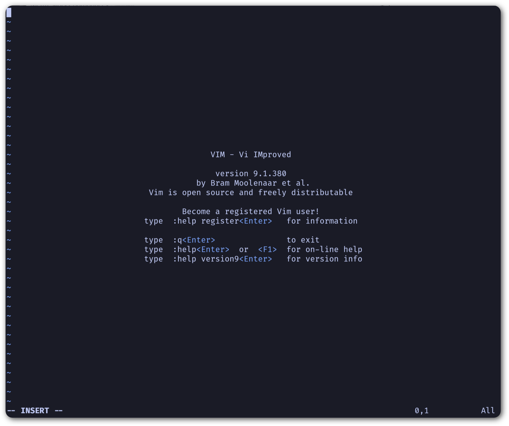
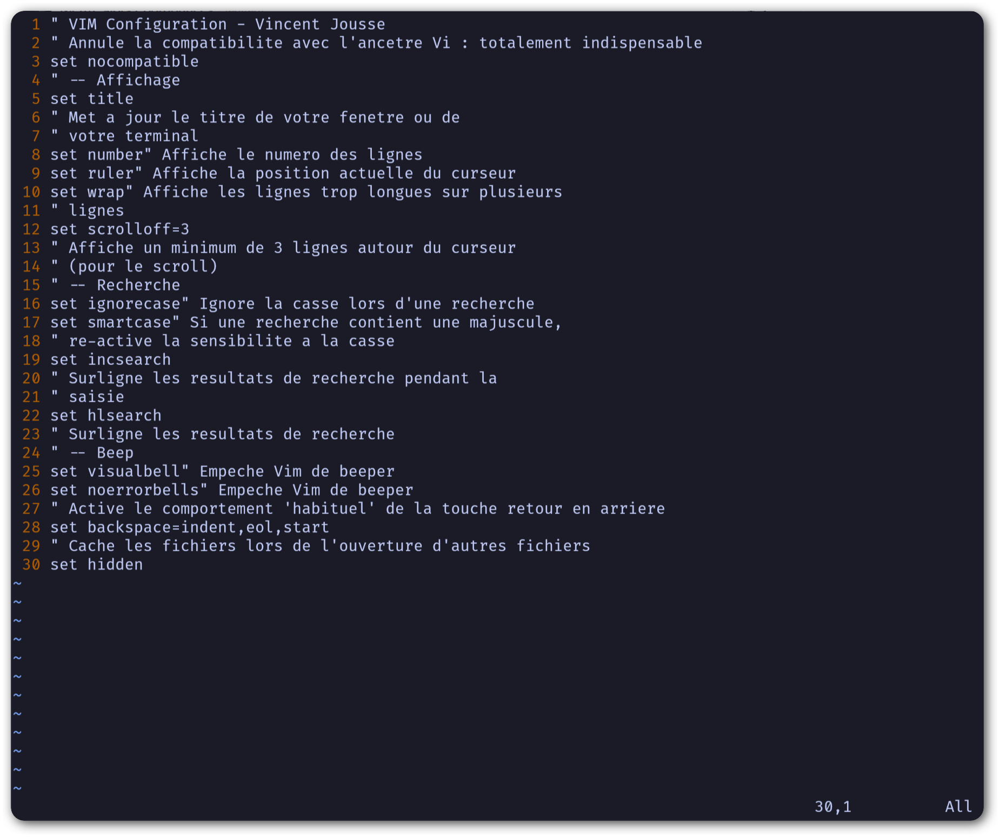
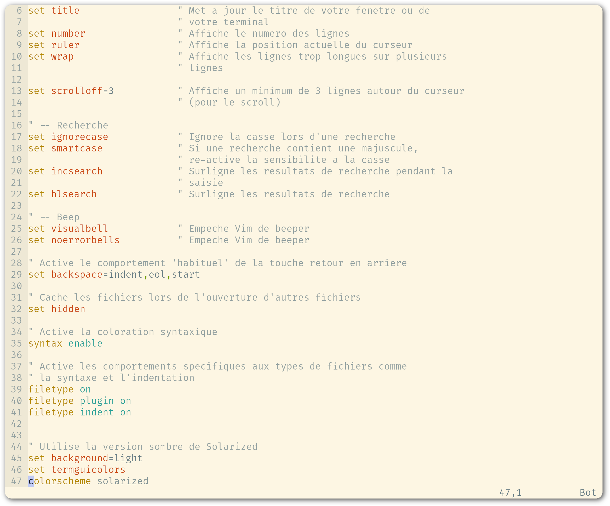
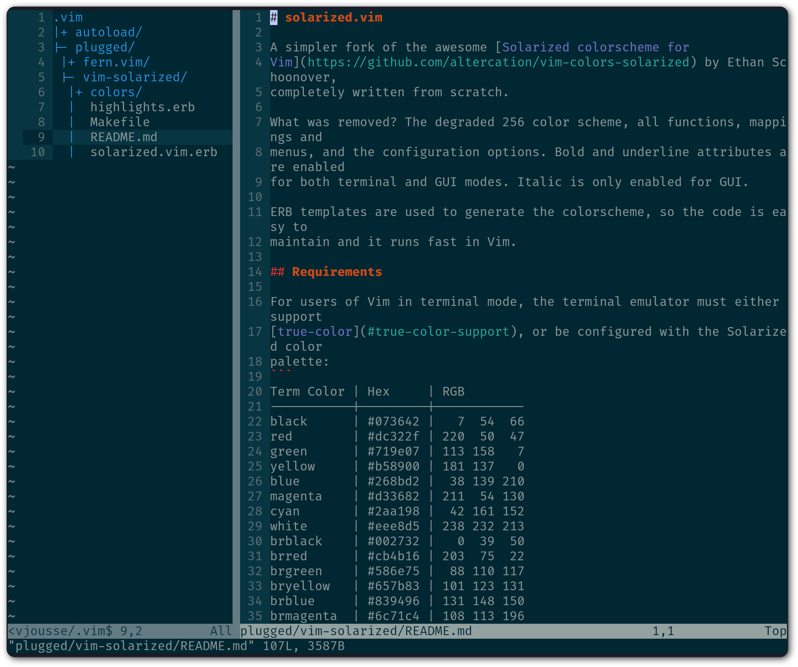

***********************
Rendre |vim| utilisable
***********************

Ça peut paraître étonnant comme approche, mais c'est pour moi la première chose à faire : rendre |vim| utilisable par un humain lambda. Si tout le monde semble s'accorder sur le fait que |vim| est un **éditeur très puissant**, tout le monde pourra aussi s'accorder sur le fait que de base, il est totalement **imbitable**. Soyons honnête, sans une configuration par défaut minimale, utiliser |vim| est **contre-productif**. 

C'est à mon avis le premier obstacle à surmonter avant toute autre chose. C'est ce que les autres éditeurs « à la mode » comme VSCode, TextMate, Sublime Text, Notepad++ ou NetBeans proposent, c'est à dire un environnement à minima utilisable tel quel, même si l'on n'en exploite pas la totalité.

Voici donc ce qui manque à un |vim| nu (et ce qui est, de mon point de vue, une **cause d'abandon pour beaucoup** d'entre vous) :

**Configuration par défaut** 
    |vim| est configurable grâce à un fichier nommé |vimrc|, qui est bien entendu vide par défaut. La première étape va être d'écrire ou de se procurer un fichier |vimrc| avec une configuration minimale.

**Coloration syntaxique**
    De base, |vim| est tout blanc et tout moche. On va utiliser le thème *Solarized* (http://ethanschoonover.com/solarized). Si votre but est d'être efficace, c'est le meilleur thème disponible actuellement (tout éditeur de texte confondu). La belle image qui suit vous donne une idée des deux looks disponibles (clair ou sombre). Pour ma part j'utilise le thème sombre.

    |solarized|

.. |solarized| image:: ../../book-tex/graphics/solarized-vim.png

**Explorateur de fichiers**
    Si vous utilisez |vim| avec une interface graphique (ce qui est le cas de 99% d'entre vous je suppose) vous avez par défaut un menu ``Fichier`` vous permettant d'ouvrir un fichier. C'est certes un bon début, mais avoir à disposition un explorateur de projet à la NetBeans ou à la TextMate peut s'avérer très pratique. Pour obtenir le même comportement, nous utiliserons *NERD tree* (https://github.com/preservim/nerdtree). À savoir qu'à la fin de ce guide, vous n'aurez plus besoin de la souris (et donc des menus et autres boutons).

Ce chapitre est indispensable si vous n'avez que peu d'expérience (voire pas du tout) avec |vim|. À la fin de ce chapitre, vous aurez un |vim| dont vous pourrez commencer à vous servir pour vos tâches de tous les jours. Cela devrait être suffisant pour vous permettre d'apprendre le reste petit à petit. Car il n'y a pas de secret, il vous faudra pratiquer pour apprendre |vim|. Autant commencer de suite et le moins douloureusement possible.

En revanche, si vous êtes déjà familier avec |vim| et n'utilisez déjà plus la souris, vous pouvez sagement sauter ce chapitre (soyez sûr tout de même de donner sa chance au thème *Solarized*).

.. _modeinsertion:

Préambule indispensable : le mode insertion
===========================================

Prenons le pari de créer le fichier |vimrc| avec |vim| lui-même. Comme je vous le disais, lus tôt vous commencerez, mieux ce sera.
Vous devrez certainement commencer par installer une version de |vim|. Si vous utilisez un Mac, essayez MacVim (https://macvim.org/) sans aucune hésitation. Si vous utilisez GNU/Linux ou tout autre système « Unix » vous devriez sûrement avoir la commande *vim* à disposition dans votre terminal. Vous pouvez aussi utiliser l'interface graphique *gVim* qui devrait être facilement installable grâce à votre gestionnaire de logiciels, pour Ubuntu le paquet correspondant est `vim-gnome`. Faites attention à bien installer la version **complète** de vim, notamment avec le support de Ruby et de Lua dont nous aurons besoin par la suite. Pour Ubuntu, le paquet sembler s'appeller `vim`. Pour Mac OS X, la question ne se pose pas, MacVim inclut déjà tout ce qu'il faut. Pour Windows, il semblerait y avoir une version disponible sur le site officiel de |vim| (http://www.vim.org/download.php), mais je ne l'ai pas testée.

**Pour ma part**, j'utilise *vim* directement en ligne de commande, sous Archlinux, dans un terminal `kitty <https://sw.kovidgoyal.net/kitty/>`_ avec la police Nerd Fonts `FiraCode Nerd Font <https://www.nerdfonts.com/font-downloads>`_. C'est avec cette configuration que les capture d'écran de ce livre sont réalisées.

Au lancement de |vim|, vous devriez avoir un texte d'accueil vous encourageant à aider les pauvres enfants en Ouganda. Ce texte disparaitra dès que nous allons saisir des caractères dans |vim|. Nous allons commencer par entrer un commentaire dans l'en-tête du fichier pour y mentionner notre nom. Pour pouvoir entrer du texte appuyez sur |tti|. Vous devriez avoir `une page`_ qui ressemble plus ou moins à la figure ci-dessous, notez bien le ``--INSERT--`` en bas à gauche qui nous indique que nous sommes en mode insertion (le mode où nous pouvons saisir du texte). Pour information, le thème de mon terminal est un thème sombre, il est donc possible que pour l'instant, les couleurs de votre |vim| soient différentes.

À l'écriture de ces lignes, la version de |vim| que j'utilise est la ``9.1.380``.

.. _une page:

**À noter** : si vous ne savez pas trop ce que vous avez fait et que |vim| vous affiche des trucs en rouge en bas à gauche ou ne semble pas réagir comme il faut quand vous appuyez sur |tti|, appuyez plusieurs fois sur |ttesc|, cela devrait vous remettre au mode par défaut de |vim|, le mode *Normal*.

Vous devriez maintenant pouvoir entrer `le commentaire ci-dessous`_ (je vous laisse évidemment changer mon nom par le votre 🤓).

.. _le commentaire ci-dessous:

.. code-block:: vim

  " VIM Configuration - Vincent Jousse

Vous aurez remarqué que les commentaires en *VimL* (le langage de configuration de |vim|) commencent par un `"`. Appuyez ensuite sur |ttesc| pour revenir au mode par défaut (le mode normal) de |vim|. Et voilà le travail, comme vous pouvez le voir sur `la copie d'écran de Vim avec votre joli commentaire`_.

.. _la copie d'écran de Vim avec votre joli commentaire:

.. image:: ../../book-tex/graphics/vim-first-comment.png

Tout ça pour ça me direz-vous, et vous avez bien raison. Et encore, on n'a même pas encore vu comment le sauvegarder. Mais tout cela a une logique que je vais vous expliquer. L'avantage de |vim| est qu'il est généralement logique. Quand vous avez compris la logique, tout vous semble limpide et tomber sous le sens.

Par défaut, |vim| est lancé dans un mode que l'on appelle le mode *Normal*. C'est à dire que ce mode n'est pas fait pour écrire du texte (ça, ça sera le mode *Insertion*) mais juste pour se déplacer et manipuler du texte. C'est la présence de ces deux différents modes (il y en a d'autres mais ce n'est pas le sujet pour l'instant) qui fait toute la puissance de |vim|. Il vous faudra un certain temps pour vous rendre compte de cette puissance par vous-même, alors faites-moi juste confiance pour l'instant.

Si vous vous demandez pourquoi ces modes, pourquoi on semble se compliquer la vie (on se la simplifie en fait) et en quel honneur, dans le mode par défaut, il n'est même pas possible d'insérer du texte, lisez attentivement la section qui suit.

.. _modes:

Les modes : d'où |vim| tire sa puissance
========================================

Je pense que nous serons tous à peu prêt d'accord sur le fait que si vous souhaitez apprendre à utiliser |vim|, c'est pour gagner en efficacité pour la saisie/manipulation de texte/code. Pour gagner en efficacité lorsque l'on tape du code il n'y a pas 36 solutions. Il n'y en a qu'une en fait : il faut bouger le moins possible les mains (voire pas du tout), et ne bouger que les doigts.

Pour ce faire bien sûr, vous oubliez tout d'abord l'utilisation de la souris. En plus d'être lent, le mouvement clavier -> souris puis souris -> clavier est très mauvais pour vos articulations. Il est souvent à l'origine de troubles musculosquelettiques. Vous êtes peut-être jeune et n'avez pas encore eu ce type de soucis. Mais croyez moi, ça vient beaucoup plus vite qu'on ne le croit. Si vous passez votre journée sur un ordinateur, ne négligez pas ces facteurs, vous le regretterez un jour. D'après *Wikipedia*, c'est le type de maladie professionnelle la plus courante à l'heure actuelle (https://fr.wikipedia.org/wiki/Troubles_musculosquelettiques).

Vous oubliez aussi le mouvement de votre main droite vers les touches directionnelles gauche/droite/bas/haut. C'est une perte de temps et c'est totalement inutile avec |vim|.

Qu'est-ce que vous avez le droit de faire dans tout ça ? Pas grand chose, si ce n'est garder vos mains sur la position de repos comme le montre `l'image ci-dessous avec la position idéale des mains`_. 

.. _l'image ci-dessous avec la position idéale des mains:

.. figure:: ../../book-tex/graphics/hand-position.png
   
   Position de repos, clavier QWERTY.

   *Illustration par Cy21 - CC-BY-SA-3.0 (http://www.creativecommons.org/licenses/by-sa/3.0*) ou GFDL (http://www.gnu.org/copyleft/fdl.html, via Wikimedia Commons http://commons.wikimedia.org/wiki/File:Typing-home-keys-hand-position.svg

Vous trouverez d'ailleurs sur la plupart des claviers des marques sur les touches F et J, c'est pour vous donner un repère tactile de la position où doivent se trouver vos index dans la position de repos.

Ce parti pris (bouger le moins possible les mains du clavier) justifie à lui seul la présence d'un mode *normal* et d'un mode *insertion* dans |vim|. En passant de l'un à l'autre, les touches sous vos doigts serviront tantôt à vous déplacer et à réaliser des opérations sur le texte : copier/coller, macros, … (c'est le mode *normal*), tantôt à sélectionner (c'est le mode *visuel*) et tantôt à insérer du texte (c'est le mode *insertion*). Tout cela bien sûr en évitant l'utilisation de combinaisons de touches du style *Ctrl + touche* qui ne sont généralement pas bonnes pour vos doigts (*Emacs* si tu nous lis, je te salue).

Par défaut, on passe du mode *insertion* au mode *normal* en appuyant sur la |ttesc|, mais c'est une des premières choses que l'on changera : |ttesc| est bien trop loin sur les claviers actuels. 

Pour passer du mode *normal* au mode *insertion*, on peut par exemple appuyer sur |tti|. On apprendra par la suite qu'il existe d'autres moyens de faire. Par exemple pour rentrer en mode insertion tout en créant une nouvelle ligne en dessous de la ligne courante (peu importe où se trouve votre curseur sur la ligne), on utilisera |tto| en mode *normal*.

J'y reviendrai plus tard dans « :ref:`se-deplacer` » mais si vous n'êtes pas prêt, à terme, à ne plus utiliser votre souris et les flèches directionnelles pour éditer du texte, je vous recommanderais presque d'arrêter votre apprentissage maintenant. C'est aussi simple que cela. |vim| révèle tout sa puissance quand il est utilisé sans souris et en bougeant le moins possible les mains.

Si vous voulez pousser la démarche encore plus loin, vous pouvez aussi vous procurer un clavier orthogonal *TypeMatrix* (http://www.typematrix.com/). C'est ce que j'utilise personnellement, et mes doigts m'en remercient tous les jours.

L'ultime changement serait d'utiliser une disposition de clavier encore plus efficace comme le *bépo* pour quasi doubler sa vitesse de frappe au clavier. Pour les plus curieux d'entre vous, j'explique la démarche sur mon blog : https://vincent.jousse.org/blog/fr/comment-doubler-sa-vitesse-de-frappe-au-clavier/

La configuration par défaut : indispensable
===========================================

Passons aux choses sérieuses, c'est-à-dire comment rendre |vim| un tant soit peu utilisable. Nous allons donc éditer le fichier de configuration par défaut |vimrc| en y plaçant des valeurs que toute personne normalement constituée souhaiterait y voir figurer.

Ce fichier doit se trouver dans votre répertoire d'accueil. */home/votre_user/.vimrc* sous Linux, */Users/votre_user/.vimrc* sous Mac OS X ou plus généralement *~/.vimrc*. Sous Windows vous pouvez créer un fichier nommé *_vimrc* qui doit se situer dans votre répertoire *%HOME%* qui change en fonction de votre version de Windows. C'est généralement le répertoire jute "au-dessus" de votre répertoire *Mes Documents*. Plus d'infos sur Wikipedia http://en.wikipedia.org/wiki/Home_directory#Default_Home_Directory_per_Operating_System.

J'ai commenté chacune des lignes du fichier directement dans le code. Rien de sorcier ici, on se demande juste pourquoi tout cela n'est pas inclus par défaut.

.. code-block:: vim

    " VIM Configuration - Vincent Jousse
    " Annule la compatibilite avec l'ancetre Vi : totalement indispensable
    set nocompatible

    " -- Affichage
    set title                 " Met a jour le titre de votre fenetre ou de
                              " votre terminal
    set number                " Affiche le numero des lignes
    set ruler                 " Affiche la position actuelle du curseur
    set wrap                  " Affiche les lignes trop longues sur plusieurs
                              " lignes

    set scrolloff=3           " Affiche un minimum de 3 lignes autour du curseur
                              " (pour le scroll)

    " -- Recherche
    set ignorecase            " Ignore la casse lors d'une recherche
    set smartcase             " Si une recherche contient une majuscule,
                              " re-active la sensibilite a la casse
    set incsearch             " Surligne les resultats de recherche pendant la
                              " saisie
    set hlsearch              " Surligne les resultats de recherche

    " -- Beep
    set visualbell            " Empeche Vim de beeper
    set noerrorbells          " Empeche Vim de beeper

    " Active le comportement 'habituel' de la touche retour en arriere
    set backspace=indent,eol,start

    " Cache les fichiers lors de l'ouverture d'autres fichiers
    set hidden

Pour ceux qui ont fait un copier/coller, il ne vous reste plus qu'à sauvegarder votre fichier nouvellement créé. Nous voulons le placer à la racine de votre compte utilisateur, c'est à dire l'enregistrer sous `~/.vimrc`. Sous Mac OS X et Linux, ``~`` désigne le répertoire d'accueil de l'utilisateur courant. Attention, les fichiers commençant par un ``.`` sont des fichiers cachés sous Linux et Mac OS X, ne vous étonnez donc pas de ne pas le voir par défaut dans votre navigateur de fichiers.

Pour le sauvegarder avec |vim|, il vous suffira, après avoir appuyé sur |ttesc| pour repasser en mode *Normal*, de taper ``:w ~/.vimrc``. Pour sauvegarder vos prochaines modifications tapez en mode *Normal* ``:w``. Pour sauvegarder et quitter ``:wq ~/.vimrc``. Pour quitter ``:q`` et pour quitter sans sauvegarder (forcer à quitter) ``:q!``.

J'ai mis en ligne ce fichier de configuration directement sur *Github*. Vous pouvez le télécharger ou le copier directement à partir d'ici : http://vimebook.com/link/v2/fr/firstconfig.

Voici à quoi devrait ressembler |vim| `après votre première configuration`_.

.. _après votre première configuration:

   |vim| après votre première configuration.

Notez l'ajout des numéros de ligne sur la gauche.

Bon c'est bien beau tout ça mais ça manque un peu de couleurs. Au suivant !

Que la couleur soit !
=====================

Tout d'abord il faut commencer par activer la coloration syntaxique du code dans le fichier de configuration. Ajoutez ces lignes à là fin de votre fichier de configuration |vimrc|.

.. code-block:: vim

    " Active la coloration syntaxique
    syntax enable
    " Active les comportements specifiques aux types de fichiers comme
    " la syntaxe et l'indentation
    filetype on
    filetype plugin on
    filetype indent on

Vous devriez avoir un |vim| qui ressemble à celui de la figure ci-dessous. 

.. figure:: ../../book-tex/graphics/vim-syntax-hl.png

   Coloration syntaxique par défaut.

Pour l'instant, le plus facile pour que les modifications apportées à votre |vimrc| soient prises en compte, c'est de le fermer et de le ré-ouvrir. Si vous voulez vraiment vous la jouer à la |vim| de suite, en mode normal tapez ``:so ~/.vimrc`` ou ``:so $MYVIMRC``.

``:so`` étant un raccourci pour ``:source``. C'est une bonne première étape, passons maintenant à l'utilisation d'un thème.

Les thèmes vont vous permettre de rendre votre |vim| un peu moins austère en changeant généralement la couleur de fond ainsi que les couleurs par défaut pour le code. Comme je l'ai mentionné plus haut, nous allons utiliser le thème *Solarized* [#solarized]_ http://ethanschoonover.com/solarized (avec fond clair ou foncé, ça dépendra de vous). 

.. [#solarized] À noter que nous utiliserons une version modernisée de *Solarized* pour vim et non l'originale disponible sur le site de l'auteur. Cette version plus récente va notamment lui permettre de fonctionner correctement sur les terminaux modernes. On l'installera à partir de ce fork https://github.com/ericbn/vim-solarized.

https://raw.githubusercontent.com/ericbn/vim-solarized/master/colors/solarized.vim

Pour l'installer, commencez tout d'abord par créer un répertoire nommé `.vim` au même endroit que votre |vimrc| (dans votre répertoire utilisateur donc). À noter que ce répertoire s'appelle `vimfiles` sous Windows. À chaque fois que je ferai référence au répertoire `.vim` ça sera en fait `vimfiles` pour les Windowsiens. Dans ce répertoire `.vim`, créez un sous-répertoire nommé `colors`. Téléchargez ensuite le fichier du thème *Solarized* https://raw.githubusercontent.com/ericbn/vim-solarized/master/colors/solarized.vim (c'est le même fichier pour les deux versions du thème) et copiez le dans le répertoire `vim/colors/` fraîchement créé.

Sous Linux vous pouvez faire tout ça via les commandes suivantes :

.. code-block:: bash

    mkdir -p ~/.vim/colors
    wget -P ~/.vim/colors https://raw.githubusercontent.com/ericbn/vim-solarized/master/colors/solarized.vim

Votre répertoire `.vim` devrait ressembler à cela :

.. code-block:: bash

    .vim
    └── colors
        └── solarized.vim

Activez ensuite le thème Solarized dans votre |vimrc| comme le montre le code ci-dessous.::

    " Utilise la version sombre de Solarized
    set background=dark
    " Active les couleurs 24-bits dans le terminal
    set termguicolors
    colorscheme solarized

Pour tester le thème clair, remplacez `dark` par `light` (au niveau de la définition de la propriété `background`).

Ci-dessous un aperçu des deux variantes (ma préférence allant à la variante sombre soit dit en re-passant).

.. figure:: ../../book-tex/graphics/vim-solarized-dark.png

   Le thème *Solarized* sombre.

   Le thème *Solarized* clair.

Un bonus (si vous n'utilisez pas |vim| directement dans votre terminal) serait de choisir une police de caractères qui vous convient un peu mieux. C'est bien sûr facultatif, mais je présume que certains d'entre vous sont des esthètes aguerris.

Si vous êtes sous Mac OS X je vous conseille la police `Monaco` qui est assez conviviale. Rajoutez les lignes suivantes à votre |vimrc| pour l'utiliser : ::

    set guifont=Monaco:h13
    set antialias

Vous pouvez bien sûr changer le `h13` par `h12` si vous voulez une police plus petite (ou par `h14` si vous en voulez une plus grande).

Sinon sous Linux j'utilise la police `DejaVu Sans Mono` que je trouve plutôt sympathique : ::

    set guifont=DejaVu\ Sans\ Mono\ 10
    set antialias

Vous pouvez là aussi bien sûr changer la taille de la police si vous le souhaitez. Pour avoir la liste des polices disponibles tapez en mode normal ``:set guifont:*``.

Vous trouverez une version complète du fichier de configuration pour ce chapitre en ligne http://vimebook.com/link/v2/fr/syntaxhlconfig. Je ne m'attarderai pas plus sur les polices, c'est assez dépendant de votre système d'exploitation, et un peu moins de |vim|.

L'explorateur de fichiers : notre premier plugin
================================================

Nous y voilà, nous avons un |vim| à peu près utilisable avec de jolies couleurs. Maintenant, il faudrait être capable d'ouvrir des fichiers, ça pourrait être pratique ! Ça va être une bonne occasion pour installer notre premier plugin. Nous allons procéder ici en deux étapes, tout d'abord installer un gestionnaire de plugins pour éviter que ça devienne trop le bazar dans vos plugins, puis installer le plugin adéquat pour explorer un répertoire de fichiers.

Gestionnaire de plugins: vim-plug
---------------------------------

`vim-plug <https://github.com/junegunn/vim-plug>`_ est le genre de plugin typique que vous découvrez après avoir commencé à configurer votre |vim| et qui génère ce type de réaction : « *Ah si j'avais su j'aurais directement commencé avec* ». Ça tombe bien, c'est ce que nous allons faire.

Tout d'abord, petite explication sur la manière d'installer et de configurer des plugins dans |vim|. Ils s'installent en copiant les fichiers adéquats (la plupart du temps avec une extension en *\*.vim*) dans des sous-répertoires de votre répertoire de configuration *.vim*. On a déjà d'ailleurs commencé à y créer un sous-répertoire `colors` qui contient notre "plugin" de coloration `solarized`.

Le problème avec cette approche c'est que les différents plugins ne sont pas isolés (vous allez devoir copier leurs fichiers dans les différents sous-répertoires) et que vous allez donc vous retrouver avec des fichiers un peu partout sans savoir à qui ils appartiennent. Autant vous dire qu'une fois que vous voulez désinstaller ou mettre à jour un plugin, c'est vite l'enfer pour savoir quels sont ses fichiers.

C'est là que *vim-plug* arrive à la rescousse, il va vous permettre d'installer chaque plugin dans un sous-répertoire rien que pour lui. Voici ce que donnerait le répertoire `.vim` d'une installation fictive de |vim| avant et après l'utilisation de *vim-plug*. 

.. code-block:: bash
    :caption: .vim avant l'utilisation de *vim-plug*

    .vim-
    ├── autoload
    │   └── phpcomplete.vim
    ├── colors
    │   └── solarized.vim
    └── syntax
        ├── php.vim
        └── sql.vim

.. code-block:: bash
    :caption: .vim après l'utilisation de *vim-plug*

    .vim
    ├── autoload
    │   └── plug.vim
    └── plugged
        ├── solarized
        │   └── colors
        │       └── solarized.vim
        ├── php
        │   ├── autoload
        │   │   └── phpcomplete.vim
        │   ├── syntax
        │   │   └── php.vim
        │   └── autoload
        └── sql
            └── syntax
                └── sql.vim

Certes la version avec *vim-plug* contient plus de sous-répertoires mais chaque plugin est isolé dans son propre répertoir. Croyez-moi sur parole, ce rangement va vous éviter bien des ennuis par la suite.

Commençons par installer *vim-plug*. Créez un répertoire nommé `autoload` dans votre répertoire `.vim` et copiez y `plug.vim` que vous pouvez télécharger ici : https://raw.githubusercontent.com/junegunn/vim-plug/master/plug.vim. Pour les utilisateurs Unix, la commande qui suit permet de l'installer automatiquement :

.. code-block:: bash

    curl -fLo ~/.vim/autoload/plug.vim --create-dirs \
        https://raw.githubusercontent.com/junegunn/vim-plug/master/plug.vim

Il nous faut maintenant activer *vim-plug* dans notre |vimrc| et le tour est joué. Nous placerons le code listé ci-dessous au début du fichier |vimrc|, directement après la ligne `set nocompatible`. Il est impératif de placer le code **au début** de votre fichier |vimrc| au risque que tout ne fonctionne pas comme souhaité. ::

    " Activation de vim-plug
    call plug#begin()

    " Nous mettrons nos plugins ici

    call plug#end()

Puisque charité bien ordonnée commence par soi-même, nous allons utiliser `vim-plug` pour gérer **solarized** au lieu de l'installer à la main comme nous l'avons fait précédemment. Commençons par supprimer le répertoire ``colors`` que nous avons créé précédemment où nous avions placé *solarized* :

.. code-block:: bash

    # Suppression du répertoire colors
    rm -rf ~/.vim/colors

Modifions ensuite notre fichier ``~/.vimrc`` pour y ajouter **solarized** comme plugin (|vim| devrait se plaindre qu'il ne peut pas trouver le thème *solarized*, vous pouvez ignorer l'erreur, nous allons justement l'installer). ::

    " Activation de vim-plug
    call plug#begin()

    " Nous mettrons nos plugins ici

    " Installation de solarized
    Plug 'ericbn/vim-solarized'

    call plug#end()

Sauvegardez et quittez en utilisant en mode normal ``:wq``. Relancez |vim| pluis, tapez ``:PlugInstall`` pour installer notre nouveau plugin (appuyez sur |ttq| pour quitter la fenêtre d'installation). Au prochain chargement de |vim|, vous devriez avoir retrouvé vos couleurs.

Voilà notre |vim| est presque prêt pour le grand bain. Il vous reste une petite étape à franchir : disposer d'un moyen pratique pour explorer les fichiers d'un projet. C'est ici que *The NERD Tree* entre en lice.

.. _secvimfern:

Explorateur de fichiers : vim-fern
----------------------------------

*vim-fern* est un plugin permettant d'afficher visuellement une arborescence de fichiers directement dans la partie gauche (par défaut) de votre |vim|, à la *VSCode*, *Sublime Text* ou encore *Eclipse/NetBeans*. Ce plugin n'est pas essentiel si vous souhaitez tout contrôler au clavier (je ne l'utilise plus moi-même), mais est assez pratique lorsque l'on débute avec |vim|.

@TODO: Vérifier si on va toujours utiliser LustExplorer
L'alternative que nous verrons plus tard au chapitre :ref:`plugins` est d'utiliser un plugin comme *LeaderF* pour trouver des fichiers et les plugins *LustyExplorer* et *LustyJuggler* pour naviguer entre les fichiers. En effet, devoir visualiser l'arborescence pour trouver un fichier est toujours plus lent que de trouver le fichier à partir de son nom par exemple. *vim-fern* vous permettra donc d'obtenir un |vim| se comportant comme un éditeur classique avec un explorateur de fichiers sur lequel vous pourrez cliquer.

Nous allons tout d'abord installer *vim-fern* à l'aide de *vim-plug* comme précédemment puis activer l'utilisation de la souris dans le terminal. ::

    " Activation de vim-plug
    call plug#begin()

    " Nous mettrons nos plugins ici

    " Installation de solarized
    Plug 'ericbn/vim-solarized'

    " Installation de vim-fern
    Plug 'lambdalisue/fern.vim'

    call plug#end()

    " -- Activation de la souris
    set mouse=a

Rechargez votre `vimrc` avec la commande suivante : ``:source $MYVIMRC`` (ou sauvegardez, quittez et réouvrez |vim| comme précédemment) puis installez le nouveau plugin grâce à ``:PlugInstall`` (appuyez sur |ttq| pour quitter la fenêtre d'installation).

Il va ensuite falloir activer le plugin. Vous pouvez le faire manuellement en tapant ``:Fern . -drawer -stay`` en mode normal. Si vous préférez activer *vim-fern* à chaque fois que vous ouvrez votre |vim|, ajoutez ces lignes à la fin de votre |vimrc|: ::

    " Activation de vim-fern au lancement de vim
    augroup FernGroup
      autocmd! *
      autocmd VimEnter * ++nested Fern . -drawer -stay
    augroup END

C'est, j'en conviens, une commande un peu barbare qui pourrait se traduire en bon vieux français par : à chaque ouverture de vim (``VimEnter``), peu importe le type de fichier (``*``), lancer *Fern* dans le répertoire courant ``.`` en mode ``drawer`` sur le côté et en gardant ``stay`` le focus sur la fenêtre actuelle (``Fern . -drawer -stay``).

Pour activer l'ouverture des répertoires et des fichiers au clic de la souris, remplacez le code ci-dessus par : ::

    augroup FernGroup
      autocmd! *
      autocmd FileType fern call s:init_fern()

      autocmd VimEnter * ++nested Fern . -drawer -stay
    augroup END

    function! s:init_fern() abort
      nmap <buffer> <LeftRelease> <Plug>(fern-action-open-or-expand)
    endfunction

Rien de particulier ensuite, *vim-fern* vous affiche l'arborescence du répertoire où vous avez lancé |vim|, comme vous le montre la capture d'écran ci-dessous. Vous pouvez utiliser la souris et/ou le clavier pour vous déplacer. À noter que |ttj| vous permet de descendre, |ttk| de remonter, |ttl| de déplier le contenu d'un répertoire ou d'ouvrir le contenu d'un fichier et |tth| de le replier. À noter qui si vous avez appuyé sur |ttenter| sur un répertoire, `vim-fern` ne vous affichera plus que le contenu de ce répertoire, il vous suffit d'appuyer sur |ttreturn| pour retourner au répertoire parent.

   |vim| avec *vim-fern* d'activé.

Vous pouvez aussi effectuer diverses commandes (créer, copier des fichiers) mais nous ne rentrerons pas en détail dans ces commandes ici. Vous pouvez toujours appuyer sur |ttquestion| dans la fenêtre de `vim-fern` pour avoir un aperçu des commandes ou vous rendre sur le `site officiel de vim-fern <https://github.com/lambdalisue/vim-fern>`_.

Pour passer de la fenêtre de *vim-fern* à la fenêtre d'édition de votre fichier au clavier, appuyez sur ``Ctrl + w`` puis ``w``. C'est à dire la touche ``Control (Ctrl)`` et tout en la laissant appuyée la touche ``w``. Vous pouvez ensuite tout lâcher pour appuyer une nouvelle fois sur ``w``. Ce raccourci clavier sera d'ailleurs toujours valable pour naviguer entre vos différentes fenêtres |vim| (il n'est pas spécifique à *vim-fern*).

Le fichier complet de votre |vimrc| à ce stade est disponible à cette adresse : http://vimebook.com/link/v2/fr/vim-plug

Nous voilà fin prêts
====================

Voilà, vous avez fait le plus dur. Enfin presque. Nous venons de couvrir ce qui manque cruellement à |vim| : une configuration par défaut acceptable. Je ne dis pas que c'est la panacée pour l'instant, mais ça devrait vous permettre d'avoir un |vim| utilisable comme n'importe quel autre éditeur de texte dont vous ne connaissez pas encore toutes les possibilités. Je vous recommande à ce stade de commencer à l'utiliser dans votre vie quotidienne. N'hésitez pas à user et à abuser de la souris pour l'instant. Le but ici étant de réduire l'impact de l'utilisation de |vim| sur votre travail quotidien. Ce n'est pas encore le temps de briller en société. Vous apprendrez les raccourcis clavier au fur et à mesure, et ça ne fait pas de vous un utilisateur de |vim| de seconde zone. Il faut bien commencer un jour.

Nous allons maintenant aborder ce qui fait l'unicité de |vim| : sa gestion des modes et des commandes pour manipuler le texte. La balle est dans votre camp maintenant : ou vous êtes prêt à changer vos habitudes et à passer à un autre niveau d'efficacité, ou alors n'utiliser |vim| que comme un bloc-notes amélioré vous convient (dans ce cas là, vous pouvez vous arrêter là). C'est vous qui voyez !
