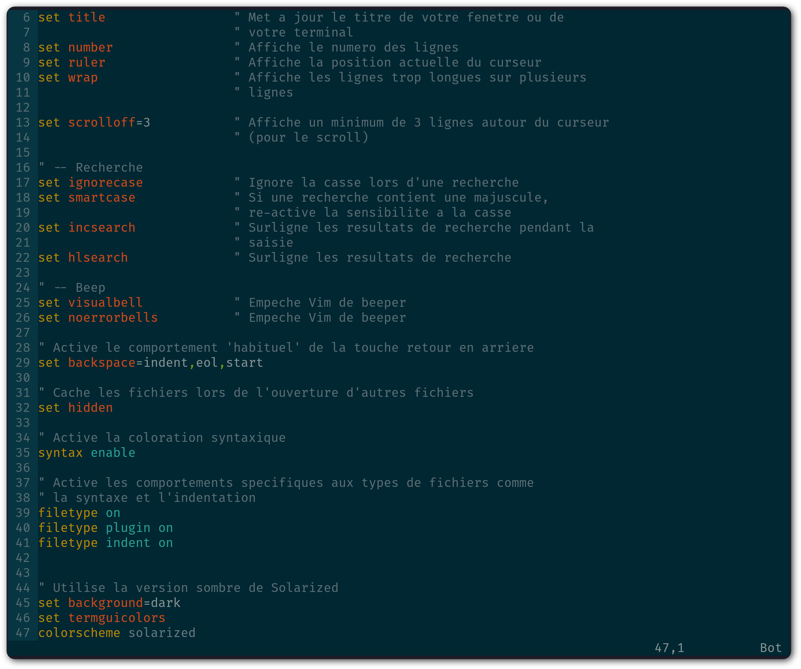

***********************
Rendre |vim| utilisable
***********************

Ça peut paraître étonnant comme approche, mais c'est pour moi la première chose à faire : rendre |vim| utilisable par un humain lambda. Si tout le monde semble s'accorder sur le fait que |vim| est un **éditeur très puissant**, tout le monde pourra aussi s'accorder sur le fait que de base, il est totalement **imbitable**. Soyons honnête, sans une configuration par défaut minimale, utiliser |vim| est **contre-productif**. 

C'est à mon avis le premier obstacle à surmonter avant toute autre chose. C'est ce que les autres éditeurs « à la mode » comme TextMate, Sublime Text, Notepad++ ou NetBeans proposent, c'est à dire un environnement à minima utilisable tel quel, même si l'on n'en exploite pas la totalité.

Voici donc ce qui manque à un |vim| nu (et ce qui est, de mon point de vue, une **cause d'abandon pour beaucoup** d'entre vous) :

**Configuration par défaut** 
    |vim| est configurable grâce à un fichier nommé |vimrc|, qui est bien entendu vide par défaut. La première étape va être d'écrire ou de se procurer un fichier |vimrc| avec une configuration minimale.

**Coloration syntaxique**
    De base, |vim| est tout blanc et tout moche. On va utiliser le thème *Solarized* (http://ethanschoonover.com/solarized). Si votre but est d'être efficace, c'est le meilleur thème disponible actuellement (tout éditeur de texte confondu). La belle image qui suit vous donne une idée des deux looks disponibles (clair ou sombre). Pour ma part j'utilise le thème sombre. 
    
    |solarized|

.. |solarized| image:: ../book-tex/graphics/solarized-yinyang-mini.png

**Explorateur de fichiers**
    Si vous utilisez |vim| avec une interface graphique (ce qui est le cas de 99% d'entre vous je suppose) vous avez par défaut un menu ``Fichier`` vous permettant d'ouvrir un fichier. C'est certes un bon début, mais avoir à disposition un explorateur de projet à la NetBeans ou à la TextMate peut s'avérer très pratique. Pour obtenir le même comportement, nous utiliserons *NERD tree* (http://www.vim.org/scripts/script.php?script_id=1658). À savoir qu'à la fin de ce guide, vous n'aurez plus besoin de la souris (et donc des menus et autres boutons).

Ce chapitre est indispensable si vous n'avez que peu d'expérience (voire pas du tout) avec |vim|. À la fin de ce chapitre, vous aurez un |vim| dont vous pourrez commencer à vous servir pour vos tâches de tous les jours. Cela devrait être suffisant pour vous permettre d'apprendre le reste petit à petit. Car il n'y a pas de secret, il vous faudra pratiquer pour apprendre |vim|. Autant commencer de suite et le moins douloureusement possible.

En revanche, si vous êtes déjà familier avec |vim| et n'utilisez déjà plus la souris, vous pouvez sagement sauter ce chapitre (soyez sûr tout de même de donner sa chance au thème *Solarized*).

.. _modeinsertion:

Préambule indispensable : le mode insertion
===========================================

Prenons le pari de créer le fichier |vimrc| avec |vim| lui-même. Comme je vous le disais, le plus tôt vous commencerez, le mieux ce sera.
Vous devrez certainement commencer par installer une version de |vim|. Si vous utilisez un Mac, essayez MacVim (http://code.google.com/p/macvim/) sans aucune hésitation. Si vous utilisez GNU/Linux ou tout autre système « Unix » vous devriez sûrement avoir gVim à votre disposition (ou tout du moins facilement installable grâce à votre gestionnaire de logiciels). Pour Windows, il semblerait y avoir une version disponible sur le site officiel de |vim| (http://www.vim.org/download.php), mais je ne l'ai pas testée.

Au lancement de |vim|, vous devriez avoir un texte d'accueil vous encourageant à aider les pauvres enfants en Ouganda. Ce texte disparaitra dès que nous allons saisir des caractères dans |vim|. Nous allons commencer par entrer un commentaire dans l'en-tête du fichier pour y mentionner notre nom. Pour pouvoir entrer du texte appuyez sur |tti| (le curseur devrait changer d'aspect). Le texte d'accueil par défaut de |vim| devrait avoir disparu et vous devriez avoir `une page blanche`_ qui ressemble plus ou moins à la figure ci-dessous.

.. _une page blanche:

.. image:: ../book-tex/graphics/vim-new.png

**À noter** : si vous ne savez pas trop ce que vous avez fait et que |vim| vous affiche des trucs en rouge en bas à gauche ou ne semble pas réagir comme il faut quand vous appuyez sur |tti|, appuyez plusieurs fois sur |ttesc|, cela devrait vous remettre au mode par défaut de |vim|, le mode *Normal*.

Vous devriez maintenant pouvoir entrer `le commentaire ci-dessous`_. 

.. _le commentaire ci-dessous:

::

    " VIM Configuration - Vincent Jousse

Vous aurez remarqué que les commentaires en *VimL* (le langage de configuration de |vim|) commencent par un `"`. Appuyez ensuite sur |ttesc| pour revenir au mode par défaut (le mode normal) de |vim|. Et voilà le travail, comme vous pouvez le voir sur `la copie d'écran de Vim avec votre joli commentaire`_.

.. _la copie d'écran de Vim avec votre joli commentaire:

.. image:: ../book-tex/graphics/vim-first-comment.png

Tout ça pour ça me direz-vous, et vous avez bien raison. Et encore, on n'a même pas encore vu comment le sauvegarder. Mais tout cela a une logique que je vais vous expliquer. L'avantage de |vim| est qu'il est généralement logique. Quand vous avez compris la logique, tout vous semble limpide et tomber sous le sens.

Par défaut, |vim| est lancé dans un mode que l'on appelle le mode *Normal*. C'est à dire que ce mode n'est pas fait pour écrire du texte (ça, ça sera le mode *Insertion*) mais juste pour se déplacer et manipuler du texte. C'est la présence de ces deux différents modes (il y en a d'autres mais ce n'est pas le sujet pour l'instant) qui fait toute la puissance de |vim|. Il vous faudra un certain temps pour vous rendre compte de cette puissance par vous-même, alors faites-moi juste confiance pour l'instant.

Si vous vous demandez pourquoi ces modes, pourquoi on semble se compliquer la vie (on se la simplifie en fait) et en quel honneur, dans le mode par défaut, il n'est même pas possible d'insérer du texte, lisez attentivement la section qui suit.

Les modes : d'où |vim| tire sa puissance
========================================

Je pense que nous serons tous à peu prêt d'accord sur le fait que si vous souhaitez apprendre à utiliser |vim|, c'est pour gagner en efficacité pour la saisie/manipulation de texte/code. Pour gagner en efficacité lorsque l'on tape du code il n'y a pas 36 solutions. Il n'y en a qu'une en fait : il faut bouger le moins possible les mains (voire pas du tout), et ne bouger que les doigts.

Pour ce faire bien sûr, vous oubliez tout d'abord l'utilisation de la souris. En plus d'être lent, le mouvement clavier -> souris puis souris -> clavier est très mauvais pour vos articulations. Il est souvent à l'origine de troubles musculosquelettiques. Vous êtes peut-être jeune et n'avez pas encore eu ce type de soucis. Mais croyez moi, ça vient beaucoup plus vite qu'on ne le croit. Si vous passez votre journée sur un ordinateur, ne négligez pas ces facteurs, vous le regretterez un jour. D'après *Wikipedia*, c'est le type de maladie professionnelle la plus courante à l'heure actuelle (https://fr.wikipedia.org/wiki/Troubles_musculosquelettiques).

Vous oubliez aussi le mouvement de votre main droite vers les touches directionnelles gauche/droite/bas/haut. C'est une perte de temps et c'est totalement inutile avec |vim|.

Qu'est-ce que vous avez le droit de faire dans tout ça ? Pas grand chose, si ce n'est garder vos mains sur la position de repos comme le montre `l'image ci-dessous avec la position idéale des mains`_. 

.. _l'image ci-dessous avec la position idéale des mains:

.. figure:: ../book-tex/graphics/hand-position.png
   
   Position de repos, clavier QWERTY.

   *Illustration par Cy21 - CC-BY-SA-3.0 (http://www.creativecommons.org/licenses/by-sa/3.0*) ou GFDL (http://www.gnu.org/copyleft/fdl.html, via Wikimedia Commons http://commons.wikimedia.org/wiki/File:Typing-home-keys-hand-position.svg

Vous trouverez d'ailleurs sur la plupart des claviers des marques sur les touches F et J, c'est pour vous donner un repère tactile de la position où doivent se trouver vos index dans la position de repos.

Ce parti pris (bouger le moins possible les mains du clavier) justifie à lui seul la présence d'un mode *normal* et d'un mode *insertion* dans |vim|. En passant de l'un à l'autre, les touches sous vos doigts serviront tantôt à vous déplacer et à réaliser des opérations sur le texte : copier/coller, macros, … (c'est le mode *normal*), tantôt à sélectionner (c'est le mode *visuel*) et tantôt à insérer du texte (c'est le mode *insertion*). Tout cela bien sûr en évitant l'utilisation de combinaisons de touches du style *Ctrl + touche* qui ne sont généralement pas bonnes pour vos doigts (*Emacs* si tu nous lis, je te salue).

Par défaut, on passe du mode *insertion* au mode *normal* en appuyant sur la |ttesc|, mais c'est une des premières choses que l'on changera : |ttesc| est bien trop loin sur les claviers actuels. 

Pour passer du mode *normal* au mode *insertion*, on peut par exemple appuyer sur |tti|. On apprendra par la suite qu'il existe d'autres moyens de faire. Par exemple pour rentrer en mode insertion tout en créant une nouvelle ligne en dessous de la ligne courante (peu importe où se trouve votre curseur sur la ligne), on utilisera |tto| en mode *normal*.

J'y reviendrai plus tard dans « \nameref{sec:se-deplacer} » mais si vous n'êtes pas prêt, à terme, à ne plus utiliser votre souris et les flèches directionnelles pour éditer du texte, je vous recommanderais presque d'arrêter votre apprentissage maintenant. C'est aussi simple que cela. |vim| révèle tout sa puissance quand il est utilisé sans souris et en bougeant le moins possible les mains.

Si vous voulez pousser la démarche encore plus loin, vous pouvez aussi vous procurer un clavier orthogonal *TypeMatrix* (http://www.typematrix.com/). C'est ce que j'utilise personnellement, et mes doigts m'en remercient tous les jours.

L'ultime changement serait d'utiliser une disposition de clavier encore plus efficace comme le *bépo* pour quasi doubler sa vitesse de frappe au clavier. Pour les plus curieux d'entre vous, j'explique la démarche sur mon blog : http://vincent.jousse.org/comment-doubler-sa-vitesse-de-frappe-au-clavier/.

La configuration par défaut : indispensable
===========================================

Passons aux choses sérieuses, c'est-à-dire comment rendre |vim| un tant soit peu utilisable. Nous allons donc éditer le fichier de configuration par défaut |vimrc| en y plaçant des valeurs que toute personne normalement constituée souhaiterait y voir figurer.

Ce fichier doit se trouver dans votre répertoire d'accueil. */home/votre_user/.vimrc* sous Linux, */Users/votre_user/.vimrc* sous Mac OS X ou plus généralement *~/.vimrc*. Sous Windows vous pouvez créer un fichier nommé *_vimrc* qui doit se situer dans votre répertoire *%HOME%* qui change en fonction de votre version de Windows. C'est généralement le répertoire jute "au-dessus" de votre répertoire *Mes Documents*. Plus d'infos sur Wikipedia http://en.wikipedia.org/wiki/Home_directory#Default_Home_Directory_per_Operating_System.

J'ai commenté chacune des lignes du fichier directement dans le code. Rien de sorcier ici, on se demande juste pourquoi tout cela n'est pas inclus par défaut.

.. include:: ../../vim-for-humans/firstconfig/vimrc
   :code:

Pour ceux qui ont fait un copier/coller, il ne vous reste plus qu'à sauvegarder votre fichier nouvellement créé. Nous voulons le placer à la racine de votre compte utilisateur, c'est à dire l'enregistrer sous `~/.vimrc`. Sous Mac OS X et Linux, *~* désigne le répertoire d'accueil de l'utilisateur courant. Attention, les fichiers commençant par un \hlred{.} sont des fichiers cachés sous Linux et Mac OS X, ne vous étonnez donc pas de ne pas le voir par défaut dans votre navigateur de fichiers.

Pour les utilisateurs de la souris, il suffira de se servir du menu `Fichier (ou File)` puis `Sauvegarder sous (ou Save as)` et de l'enregistrer dans le répertoire d'accueil de l'utilisateur courant sous le nom de `.vimrc`. Pour ceux qui veulent déjà utiliser le clavier, il vous suffira, après avoir appuyé sur |ttesc| pour repasser en mode *Normal*, de taper :vimcmd:`:sav ~/.vimrc`. Pour sauvegarder vos prochaines modifications, utilisez le menu avec la souris ou tapez en mode *Normal* :vimcmd:`:w`.

J'ai mis en ligne ce fichier de configuration directement sur *Github*. Vous pouvez le télécharger ou le copier directement à partir d'ici : http://vimebook.com/link/fr/firstconfig.

Vous devriez avoir un |vim| qui ressemble à celui sur la figure \ref{fig:first-config}. 
Voici à quoi devrait ressembler |vim| `après votre première configuration`_.

.. _après votre première configuration:

.. figure:: ../book-tex/graphics/vim-first-config.png

   |vim| après votre première configuration.

Notez les numéros de ligne sur la gauche ainsi que la position du curseur en bas à droite.

Bon c'est bien beau tout ça mais ça manque un peu de couleurs. Au suivant !

Que la couleur soit !
=====================

Tout d'abord il faut commencer par activer la coloration syntaxique du code dans le fichier de configuration. Ajoutez ces lignes à là fin de votre fichier de configuration |vimrc|.::

    " Active la coloration syntaxique
    syntax enable
    " Active les comportements specifiques aux types de fichiers comme
    " la syntaxe et l'indentation
    filetype on
    filetype plugin on
    filetype indent on

Vous devriez avoir un |vim| qui ressemble à celui de la figure ci-dessous. 

.. figure:: ../book-tex/graphics/vim-syntax-hl.png

   Coloration syntaxique par défaut.

Pour l'instant, le plus facile pour que les modifications apportées à votre |vimrc| soient prises en compte, c'est de le fermer et de le ré-ouvrir. Si vous voulez vraiment vous la jouer à la |vim| de suite, en mode normal tapez :vimcmd:`:so \textasciitilde/.vimrc` ou :vimcmd:`:so \$MYVIMRC`.

:vimcmd:`:so` étant un raccourci pour :vimcmd:`:source`. C'est une bonne première étape, passons maintenant à l'utilisation d'un thème.

Les thèmes vont vous permettre de rendre votre |vim| un peu moins austère en changeant généralement la couleur de fond ainsi que les couleurs par défaut pour le code. Comme je l'ai mentionné plus haut, nous allons utiliser le thème *Solarized* http://ethanschoonover.com/solarized (avec fond clair ou foncé, ça dépendra de vous).

Pour l'installer, commencez tout d'abord par créer un répertoire nommé `.vim` au même endroit que votre |vimrc| (dans votre répertoire utilisateur donc). À noter que ce répertoire s'appelle `vimfiles` sous Windows. À chaque fois que je ferai référence au répertoire `.vim` ça sera en fait `vimfiles` pour les Windowsiens. Dans ce répertoire `.vim`, créez un sous-répertoire nommé `colors`. Téléchargez ensuite le fichier du thème *Solarized* https://raw.github.com/altercation/vim-colors-solarized/master/colors/solarized.vim (c'est le même fichier pour les deux versions du thème) et copiez le dans le répertoire `vim/colors/` fraîchement créé. Votre répertoire `.vim` devrait ressembler à celui de la figure ci-dessous.

.. figure:: ../book-tex/graphics/solarized-tree.png

   Le contenu du répertoire .vim avec Solarized.

Activez ensuite le thème Solarized dans votre |vimrc| comme le montre le code ci-dessous.::

    " Utilise la version sombre de Solarized
    set background=dark
    colorscheme solarized

Pour tester le thème clair, remplacez `dark` par `light` (au niveau de la définition de la propriété `background`).

Ci-dessous un aperçu des deux variantes (ma préférence allant à la variante sombre soit dit en re-passant).

   Le thème *Solarized* sombre.

.. figure:: ../book-tex/graphics/vim-solarized-light.png

   Le thème *Solarized* clair.

Un bonus (si vous n'utilisez pas |vim| directement dans votre terminal) serait de choisir une police de caractères qui vous convient un peu mieux. C'est bien sûr facultatif, mais je présume que certains d'entre vous sont des esthètes aguerris.

Si vous êtes sous Mac OS X je vous conseille la police `Monaco` qui est assez conviviale. Rajoutez les lignes suivantes à votre |vimrc| pour l'utiliser : ::

    set guifont=Monaco:h13
    set antialias

Vous pouvez bien sûr changer le `h13` par `h12` si vous voulez une police plus petite (ou par `h14` si vous en voulez une plus grande).

Sinon sous Linux j'utilise la police `DejaVu Sans Mono` que je trouve plutôt sympathique : ::

    set guifont=DejaVu\ Sans\ Mono\ 10
    set antialias

Vous pouvez là aussi bien sûr changer la taille de la police si vous le souhaitez. Pour avoir la liste des polices disponibles tapez en mode normal :vimcmd:`:set guifont:*`.

Vous trouverez une version complète du fichier de configuration pour ce chapitre en ligne http://vimebook.com/link/fr/syntaxhlconfig. Je ne m'attarderai pas plus sur les polices, c'est assez dépendant de votre système d'exploitation, et un peu moins de |vim|.

L'explorateur de fichiers : notre premier plugin
================================================

Nous y voilà, nous avons un |vim| à peu près utilisable avec de jolies couleurs. Maintenant, il faudrait être capable d'ouvrir des fichiers autrement qu'en faisant `Fichier (File) -> Ouvrir (Open)`. Ça va être une bonne occasion pour installer notre premier plugin (ce n'est pas comme si nous avions d'autres choix de toute façon). Nous allons procéder ici en deux étapes, tout d'abord installer un gestionnaire de plugins pour éviter que ça devienne trop le bazar dans vos plugins, puis installer le plugin adéquat pour explorer un répertoire de fichiers.

Gestionnaire de plugins: Pathogen
---------------------------------

*Pathogen* (https://github.com/tpope/vim-pathogen/) est le genre de plugin typique que vous découvrez après avoir commencé à configurer votre |vim| et qui génère ce type de réaction : « Ah si j'avais su j'aurais directement commencé avec ». Ça tombe bien, c'est ce que nous allons faire.

Tout d'abord, petite explication sur la manière d'installer et de configurer des plugins dans |vim|. Ils s'installent en copiant les fichiers adéquats (la plupart du temps avec une extension en *\*.vim*) dans des sous-répertoires de votre répertoire de configuration *.vim*. On a déjà d'ailleurs commencé à y créer un sous-répertoire `colors` qui contient notre "plugin" de coloration Solarized.

Le problème avec cette approche c'est que les différents plugins ne sont pas isolés (vous allez devoir copier leurs fichiers dans les différents sous-répertoires) et que vous allez donc vous retrouver avec des fichiers un peu partout sans savoir à qui ils appartiennent. Autant vous dire qu'une fois que vous voulez désinstaller ou mettre à jour un plugin, c'est vite l'enfer pour savoir quels sont ses fichiers.

C'est là que *Pathogen* arrive à la rescousse, il va vous permettre d'installer chaque plugin dans un sous-répertoire rien que pour lui. Voici un exemple de répertoire `.vim` avant et après l'utilisation de *Pathogen*. 

.. figure:: ../book-tex/graphics/pathogen-tree.png

   *.vim* avant et après Pathogen.

Certes la version avec *Pathogen* contient plus de sous-répertoires, mais croyez-moi sur parole, ce rangement va vous éviter bien des ennuis par la suite. Vous pourrez au passage très facilement utiliser *git* pour gérer chacun de vos plugins comme des submodules, ce qui peut s'avérer très pratique.

Commençons par installer *Pathogen*. Créez un répertoire nommé `autoload` dans votre répertoire `.vim` et copiez y `pathogen.vim` que vous pouvez télécharger ici : https://raw.github.com/tpope/vim-pathogen/master/autoload/pathogen.vim. Pour les utilisateurs Unix, le listing qui suit explique comment l'installer. Si vous n'avez pas `curl` vous pouvez aussi utiliser `wget -O -`.

.. code-block:: bash

    # Creation du repertoire autoload
    mkdir -p ~/.vim/autoload 

    # Telechargement et installation de pathogen
    curl -so ~/.vim/autoload/pathogen.vim \
        https://raw.github.com/tpope/vim-pathogen/master/autoload/pathogen.vim

Nous installerons ensuite nos plugins directement dans le répertoire `.vim/bundle` que vous allez vous empresser de créer de cette manière :

.. code-block:: bash

    # Creation du repertoire bundle
    mkdir -p ~/.vim/bundle

Il ne vous reste plus qu'à activer pathogen dans votre |vimrc| et le tour est joué. Nous placerons le code listé ci-dessous au début du fichier |vimrc|, directement après la ligne `set nocompatible`. Il est impératif de placer le code **au début** de votre fichier |vimrc|, sinon ça ne marchera pas.::

    " Activation de pathogen
    call pathogen#infect()

Puisque charité bien ordonnée commence par soi-même, nous allons ranger notre petit plugin *Solarized* en utilisant *Pathogen*. Il nous suffit de créer un répertoire `solarized` dans notre répertoire `bundle` fraîchement créé. Vous pouvez l'appeler comme vous le souhaitez, tout sous-répertoire du répertoire `bundle` sera considéré comme un répertoire de plugin. Nous déplaçons ensuite le répertoire `colors` dans le répertoire `solarized` comme ceci :

.. code-block:: bash

    # Creation du repertoire pour solarized
    mkdir ~/.vim/bundle/solarized
    # Et hop un peu de rangement
    mv ~/.vim/colors ~/.vim/bundle/solarized

Actuellement, Pathogen reste encore le gestionnaire de plugins |vim| le plus utilisé. Mais depuis peu, un challenger est arrivé, il s'appelle Vundle https://github.com/gmarik/vundle. J'ai choisi de vous présenter Pathogen car c'est de lui que vous entendrez le plus parler, mais sachez que Vundle est aussi une alternative intéressante : il est compatible avec Pathogen et il gère les versions et les mises à jours de vos plugins directement depuis internet. Pour ceux qui connaissent Ruby, c'est le Bundler (http://gembundler.com/) pour |vim|.

Voilà notre |vim| est presque prêt pour le grand bain. Il vous reste une petite étape à franchir : disposer d'un moyen pratique pour explorer les fichiers d'un projet. C'est ici que *The NERD Tree* entre en lice.

Explorateur de fichiers : The NERD Tree
---------------------------------------

The NERD Tree est un plugin permettant d'afficher visuellement une arborescence de fichiers directement dans la partie gauche (par défaut) de votre |vim|, à la *TextMate*, *Sublime Text* ou encore *Eclipse/NetBeans*. Ce plugin n'est pas essentiel si vous souhaitez tout contrôler au clavier (je ne l'utilise plus moi-même), mais est assez pratique lorsque l'on débute avec |vim|.

L'alternative que nous verrons plus tard au chapitre \nameref{plugins} est d'utiliser les plugin *Ctrl-p* ou *Command-t* pour trouver des fichiers et les plugins *LustyExplorer* et *LustyJuggler* pour naviguer entre les fichiers. En effet, devoir visualiser l'arborescence pour trouver un fichier est toujours plus lent que de trouver le fichier à partir de son nom par exemple. The NERD Tree vous permettra donc d'obtenir un |vim| se comportant comme un éditeur classique avec un explorateur de fichiers sur lequel vous pourrez cliquer.

Nous allons tout d'abord préparer *Pathogen* pour installer les différents fichiers de *The NERD Tree*.

.. code-block:: bash

    # Creation du repertoire pour The NERD Tree
    mkdir ~/.vim/bundle/nerdtree

Téléchargez ensuite le dernier *.zip* disponible sur la page du plugin http://www.vim.org/scripts/script.php?script_id=1658. À l'heure où j'écris ces lignes, la dernière version disponible est la version 4.2.0 que vous pouvez télécharger à cette adresse : http://www.vim.org/scripts/download_script.php?src_id=17123.

Ouvrez le fichier zip et placez son contenu dans le répertoire ``~/.vim/bundle/nerdtree`` que nous venons de créer. Vous devriez avoir une arborescence ressemblant à celle ci-dessous pour votre répertoire ``nerdtree`` :

.. code-block:: html

    nerdtree
    |-- doc
    |   `-- NERD_tree.txt
    |-- nerdtree_plugin
    |   |-- exec_menuitem.vim
    |   `-- fs_menu.vim
    |-- plugin
    |   `-- NERD_tree.vim
    `-- syntax
        `-- nerdtree.vim

Il va ensuite falloir activer le plugin. Vous pouvez le faire manuellement en tapant :vimcmd:`:NERDTree` en mode normal. Si vous préférez activer *The NERD Tree* à chaque fois que vous ouvrez votre |vim|, ajoutez ces lignes dans votre |vimrc|: ::

    " Activation de NERDTree au lancement de vim
    autocmd vimenter * NERDTree

C'est, j'en conviens, une commande un peu barbare qui pourrait se traduire en bon vieux français par : à chaque ouverture de vim (``vimenter``), peu importe le type de fichier (``*``), lancer *The NERD Tree* (``NERDTree``).

Rien de particulier ensuite, *The NERD Tree* vous affiche l'arborescence du répertoire où vous avez lancé |vim|, comme vous le montre la capture d'écran ci-dessous. Vous pouvez utiliser la souris et/ou le clavier pour vous déplacer. 

.. figure:: ../book-tex/graphics/vim-nerdtree.png

   |vim| avec *The NERD Tree* d'activé.

Vous pouvez aussi effectuer des commandes (créer, copier des fichiers) en appuyant sur |ttm| lorsque vous êtes dans *The NERD Tree*. Pour passer de la fenêtre de *NERD Tree* à la fenêtre d'édition de votre fichier au clavier, appuyez sur ``Ctrl + w`` puis ``w``. C'est à dire la touche ``Control (Ctrl)`` et tout en la laissant appuyée la touche ``w``. Vous pouvez ensuite tout lâcher pour appuyer une nouvelle fois sur ``w``. Ce raccourci clavier sera d'ailleurs toujours valable pour naviguer entre vos différentes fenêtres |vim| (il n'est pas spécifique à *The NERD Tree*).

Nous voilà fin prêts
====================

Voilà, vous avez fait le plus dur. Enfin presque. Nous venons de couvrir ce qui manque cruellement à |vim| : une configuration par défaut acceptable. Je ne dis pas que c'est la panacée pour l'instant, mais ça devrait vous permettre d'avoir un |vim| utilisable comme n'importe quel autre éditeur de texte dont vous ne connaissez pas encore toutes les possibilités. Je vous recommande à ce stade de commencer à l'utiliser dans votre vie quotidienne. N'hésitez pas à user et à abuser de la souris et des différents menus qui sont à votre disposition. Le but ici étant de réduire l'impact de l'utilisation de |vim| sur votre travail quotidien. Ce n'est pas encore le temps de briller en société. Vous apprendrez les raccourcis clavier au fur et à mesure, et ça ne fait pas de vous un utilisateur de |vim| de seconde zone. Il faut bien commencer un jour.

Nous allons maintenant aborder ce qui fait l'unicité de |vim| : sa gestion des modes et des commandes pour manipuler le texte. La balle est dans votre camp maintenant : ou vous êtes prêt à changer vos habitudes et à passer à un autre niveau d'efficacité, ou alors n'utiliser |vim| que comme un bloc-notes amélioré vous convient (dans ce cas là, vous pouvez vous arrêter là). C'est vous qui voyez !
