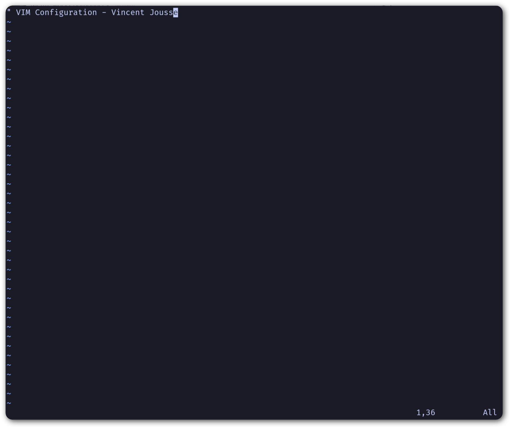

***********************
Rendre |vim| utilisable
***********************

Ça peut paraître étonnant comme approche, mais c'est pour moi la première chose à faire : rendre |vim| utilisable par un humain lambda. Si tout le monde semble s'accorder sur le fait que |vim| est un **éditeur très puissant**, tout le monde pourra aussi s'accorder sur le fait que de base, il est totalement **imbitable**. Soyons honnête, sans une configuration par défaut minimale, utiliser |vim| est **contre-productif**. 

C'est à mon avis le premier obstacle à surmonter avant toute autre chose. C'est ce que les autres éditeurs « à la mode » comme TextMate, Sublime Text, Notepad++ ou NetBeans proposent, c'est à dire un environnement à minima utilisable tel quel, même si l'on n'en exploite pas la totalité.

Voici donc ce qui manque à un |vim| nu (et ce qui est, de mon point de vue, une **cause d'abandon pour beaucoup** d'entre vous) :

**Configuration par défaut** 
    |vim| est configurable grâce à un fichier nommé \vimrc, qui est bien entendu vide par défaut. La première étape va être d'écrire ou de se procurer un fichier \vimrc avec une configuration minimale.

**Coloration syntaxique**
    De base, |vim| est tout blanc et tout moche. On va utiliser le thème *Solarized* (http://ethanschoonover.com/solarized). Si votre but est d'être efficace, c'est le meilleur thème disponible actuellement (tout éditeur de texte confondu). La belle image qui suit vous donne une idée des deux looks disponibles (clair ou sombre). Pour ma part j'utilise le thème sombre. 
    
    |solarized|

.. |solarized| image:: ../book-tex/graphics/solarized-yinyang-mini.png

**Explorateur de fichiers**
    Si vous utilisez |vim| avec une interface graphique (ce qui est le cas de 99% d'entre vous je suppose) vous avez par défaut un menu ``Fichier`` vous permettant d'ouvrir un fichier. C'est certes un bon début, mais avoir à disposition un explorateur de projet à la NetBeans ou à la TextMate peut s'avérer très pratique. Pour obtenir le même comportement, nous utiliserons *NERD tree* (http://www.vim.org/scripts/script.php?script_id=1658). À savoir qu'à la fin de ce guide, vous n'aurez plus besoin de la souris (et donc des menus et autres boutons).

Ce chapitre est indispensable si vous n'avez que peu d'expérience (voire pas du tout) avec |vim|. À la fin de ce chapitre, vous aurez un |vim| dont vous pourrez commencer à vous servir pour vos tâches de tous les jours. Cela devrait être suffisant pour vous permettre d'apprendre le reste petit à petit. Car il n'y a pas de secret, il vous faudra pratiquer pour apprendre |vim|. Autant commencer de suite et le moins douloureusement possible.

En revanche, si vous êtes déjà familier avec |vim| et n'utilisez déjà plus la souris, vous pouvez sagement sauter ce chapitre (soyez sûr tout de même de donner sa chance au thème *Solarized*).

Préambule indispensable : le mode insertion
===========================================

Prenons le pari de créer le fichier |vimrc| avec |vim| lui-même. Comme je vous le disais, le plus tôt vous commencerez, le mieux ce sera.
Vous devrez certainement commencer par installer une version de |vim|. Si vous utilisez un Mac, essayez MacVim (http://code.google.com/p/macvim/) sans aucune hésitation. Si vous utilisez GNU/Linux ou tout autre système « Unix » vous devriez sûrement avoir gVim à votre disposition (ou tout du moins facilement installable grâce à votre gestionnaire de logiciels). Pour Windows, il semblerait y avoir une version disponible sur le site officiel de |vim| (http://www.vim.org/download.php), mais je ne l'ai pas testée.

Au lancement de |vim|, vous devriez avoir un texte d'accueil vous encourageant à aider les pauvres enfants en Ouganda. Ce texte disparaitra dès que nous allons saisir des caractères dans |vim|. Nous allons commencer par entrer un commentaire dans l'en-tête du fichier pour y mentionner notre nom. Pour pouvoir entrer du texte appuyez sur |tti| (le curseur devrait changer d'aspect). Le texte d'accueil par défaut de \vim devrait avoir disparu et vous devriez avoir `une page blanche`_ qui ressemble plus ou moins à la figure ci-dessous.

.. _une page blanche:

.. image:: ../book-tex/graphics/vim-new.png

Vous devriez maintenant pouvoir entrer le commentaire ci-dessous. 

**À noter** : si vous ne savez pas trop ce que vous avez fait et que |vim| vous affiche des trucs en rouge en bas à gauche ou ne semble pas réagir comme il faut quand vous appuyez sur |tti|, appuyez plusieurs fois sur |ttesc|, cela devrait vous remettre au mode par défaut de |vim|, le mode *Normal*.::

    " VIM Configuration - Vincent Jousse

Vous aurez remarqué que les commentaires en *VimL* (le langage de configuration de |vim|) commencent par un `"`. Appuyez ensuite sur |ttesc| pour revenir au mode par défaut (le mode normal) de |vim|. Et voilà le travail, comme vous pouvez le voir sur `la copie d'écran de Vim avec votre joli commentaire`_.

.. _la copie d'écran de Vim avec votre joli commentaire:

Tout ça pour ça me direz-vous, et vous avez bien raison. Et encore, on n'a même pas encore vu comment le sauvegarder. Mais tout cela a une logique que je vais vous expliquer. L'avantage de |vim| est qu'il est généralement logique. Quand vous avez compris la logique, tout vous semble limpide et tomber sous le sens.

